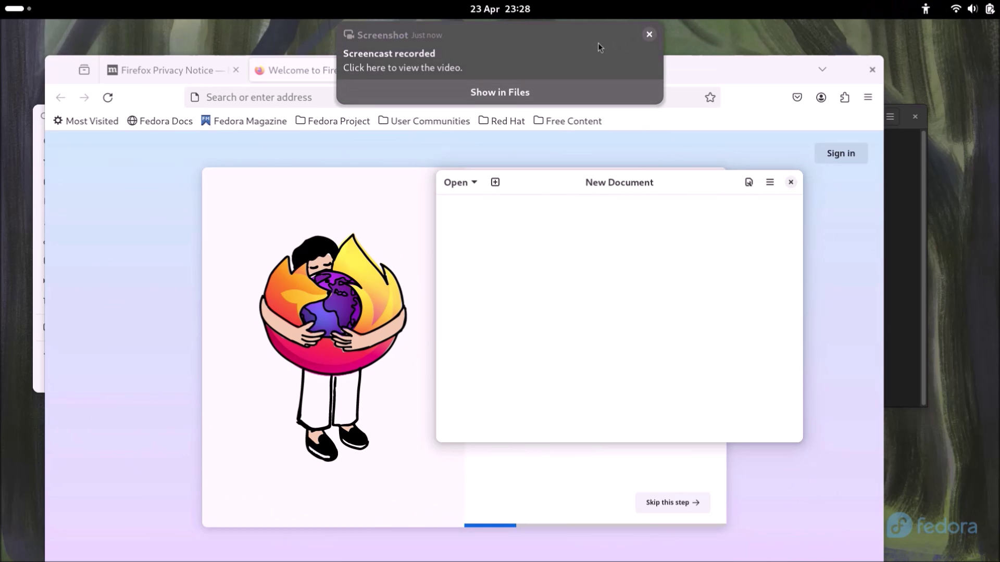

## Applications

When coming from Linux to Windows, alternative applications need to be used. 

The GNOME text editor and calculator come preinstalled with GNOME and are equivalents to preinstalled Windows applications such as notepad and calculator. 

### Browsers

For Browser, FireFox is preinstalled:

FireFox supports GNOMEs onscreen keyboard:

Much of the internet has standardised on the open source Chromium project, with Microsoft Edge and Google Chrome browsers being based on Chromium. Chromium can be installed from Software:

Unfortunately Chromium does not support the screen keyboard:

There is no response by the screen keyboard when a touch input field is pressed:

Note Chromium lacks many of the proprietary
 multimedia codecs that Google provide in Chrome. Chrome can also be installed from GNOME Software:

This may be important when it comes to using streaming services for multimedia playback:

### Office Suite

LibreOffice comes preinstalled. However an Office suite with a more similar user interface to Microsoft Office and better compatibility with Microsoft Office Documents is available and OnlyOffice Desktop Editors can be installed from GNOME Software:

OnlyOffice Desktop Editors has a Document Editor:

A SpreadSheet Editor:

And a Presentation Editor:

### Paint

There is no counterpart to paint preinstalled in GNOME. Software has a number fo equivalents but many of these are quite buggy. The closest program to paint is actually a browser reimplementation of paint:

* [jspaint](https://jspaint.app/)

This by default displays using the Windows XP skin:

The theme can be changed by going to Extras → Themes → Modern Light:

The new theme displays:

This looks better but it is missing the ability to zoom out to values less than 100 % which was implemented in the Windows 7 paint.

## GNOME Capture

GNOME Capture is the counterpart to the Snipping Tool in Windows. It can be activated using the `PrtScr` button. There is an option to capture a selection:

The full screen:

Or a Window:

Once the select is made, select capture:

The image is automatically saved to `~/Pictures/Screenshots`

GNOME Capture also has the option to take a screen recording:

When the Record button is selected:

The timer will display in the titlebar and can be pressed to end the screen recording:

The video is automatically saved to `~/Videos/Screencasts`

Unfortunately at present, the screen recording does not include the mouse cursor:

This is a screen capture of the video playback using a capture device and the mouse cursor shown is not the one that should be in the video.

[Return to Fedora Installation Guide](./readme.md).