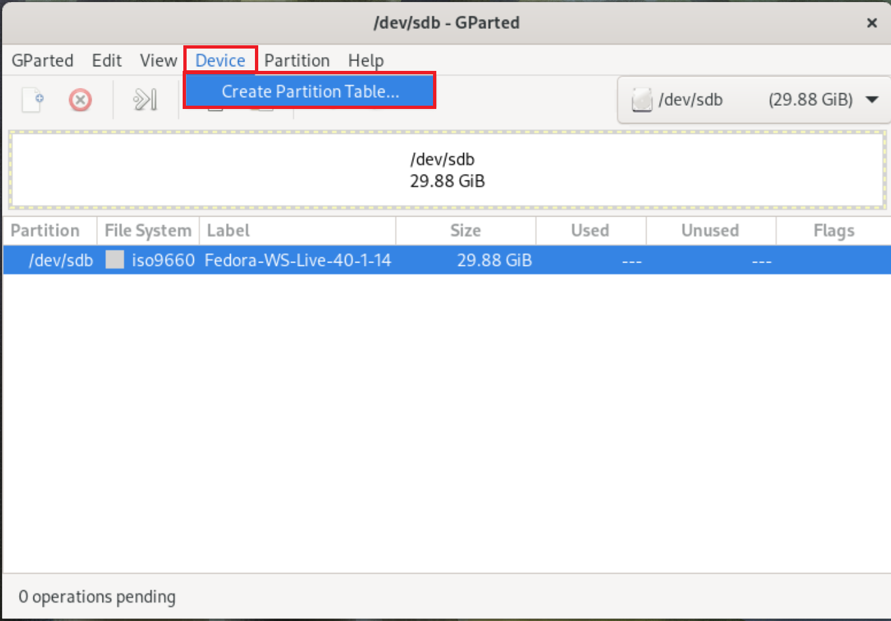
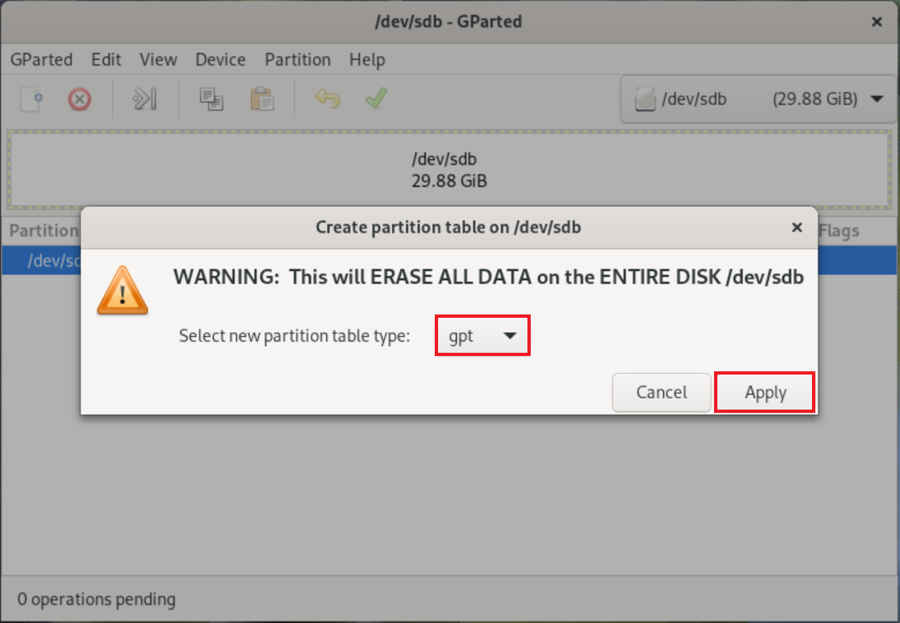
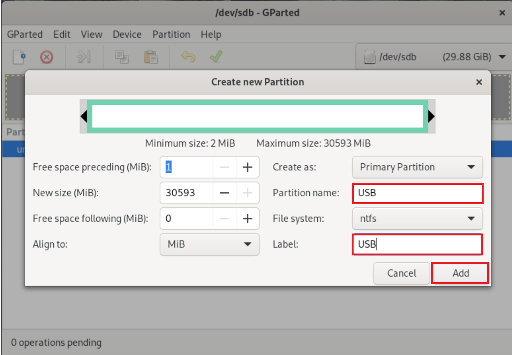
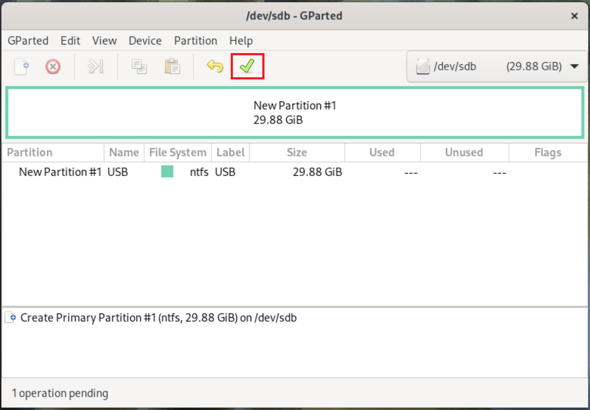
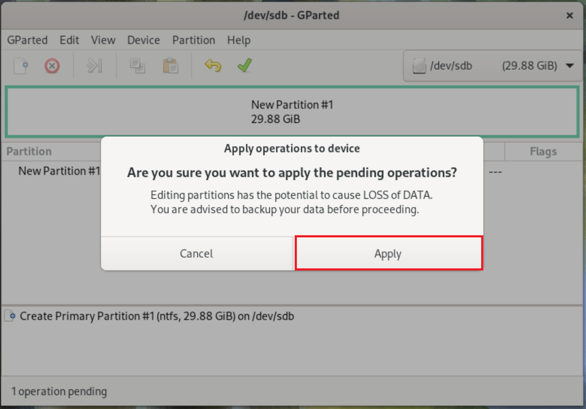
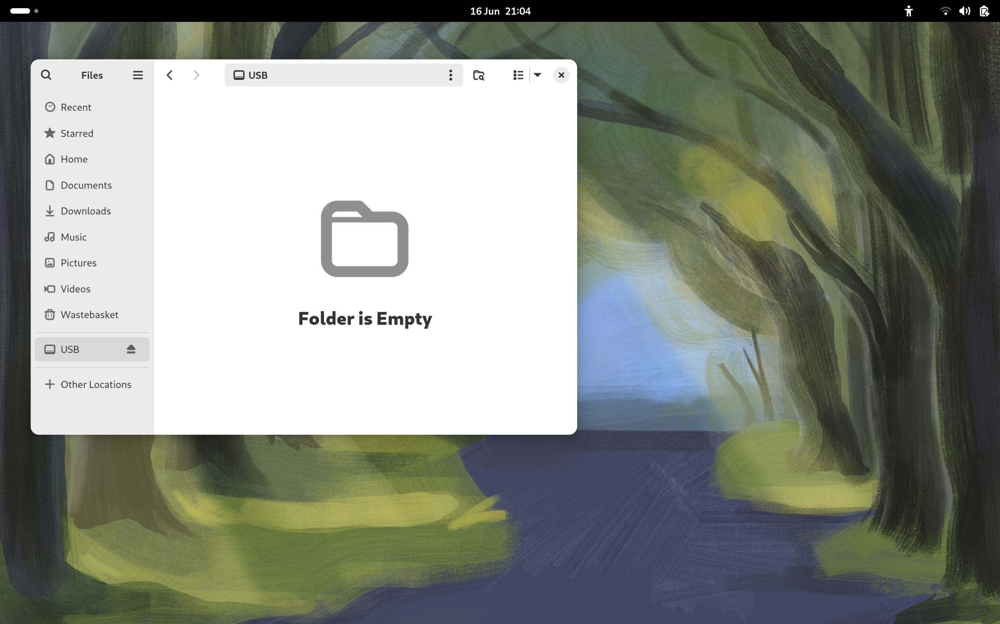

## BIOS Update from USB Linux

The Dell BIOS can be updated from a USB Flash Drive.

### Partition a USB Flash Drive Using GParted

The USB 3.0 Flash Drive should be >8 GB and formatted using the GPT Partition Table with a single NTFS Partition.

On Linux, GParted can be used to format the USB Flash Drive. Press `⊞` to display the GNOME Dock and applications screen. Search for GParted. If it is not preinstalled. Open up software:

Select GParted:

Select Install:

Select Open:

GParted needs elevated permissions to partition USB Flash Drives and needs to be run as a super user. The following Authentication Prompt will display, which is the Linux counterpart to Windows User Account Control. Input your password and select Authenticate:

To the left select your USB Flash Drive:

Select Device → Create Partition Table:

Select GPT:

Right click unallocated space and select New:

Use the default sizes to create a single partition which spans across the drive. Set the Partition Name to USB and Label to USB. Select Add:

Select apply:

Select apply:

Select Close:

The USB Flash Drive is now has a GPT Partition Table with a single NTFS partition:

### Downloading the BIOS Update

Go to [Dell Drivers and Downloads](https://www.dell.com/support/home/en-uk/products?app=drivers). Select Browse All Products:

Select your System Model:

Under Operating System select BIOS:

Download the latest BIOS Update:

The BIOS Update will be saved in Downloads:

Right click the BIOS Update and select copy:

Copy the BIOS Update to the USB:

### Booting in the BIOS Boot Menu

Insert the USB Flash Drive with the BIOS Update. Press `F12` on a Dell to get to the BIOS Boot Menu:

To the top right, the BIOS Version will be listed:

Select Flash from File:

Select the USB Flash Drive:

Select the BIOS Update and select Submit:

Select Update BIOS:

The BIOS Update will now be applied and the computer will restart:

[Return to Fedora Installation Guide](./readme.md).