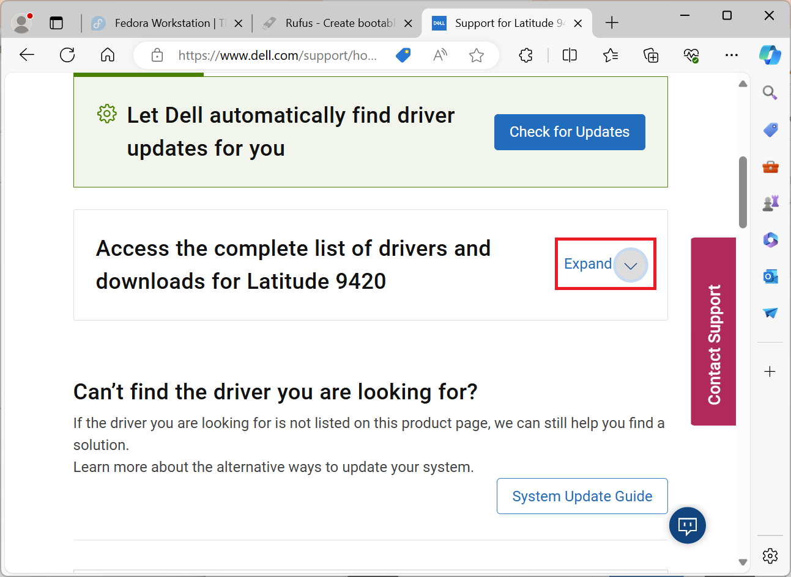

## BIOS Update from USB Windows

The Dell BIOS can be updated from a USB Flash Drive.

### Partition a USB Flash Drive Using Rufus

The USB 3.0 Flash Drive should be >8 GB and formatted using the GPT Partition Table with a single NTFS Partition.

Go to the [Rufus Download Page](https://rufus.ie/en/) and select the latest version of Rufus:

The Rufus application will be saved in the Downloads folder

Select Rufus:

Accept the User Account Control Prompt:

Select: 

* Device: Your USB Flash Drive
* Boot Selection: Non-Bootable
* Partition Table: GPT
* Volume Label: Input a Volume Label e.g. USB
* File System: NTFS

Then select Start:

Select OK:

Select Finish:

The USB Flash Drive now has a GPT Partition Table with a single NTFS Partition. 

### Downloading the BIOS Update

Go to [Dell Drivers and Downloads](https://www.dell.com/support/home/en-uk/products?app=drivers). Select Browse All Products:

Select your System Model:

Select Expand:

Under Category, select BIOS:

Download the latest BIOS Update:

Right click the update and select Copy:

The paste it to the USB Flash Drive:

The USB Flash Drive with the BIOS Update is now prepared:

### Booting in the BIOS Boot Menu

Insert the USB Flash Drive with the BIOS Update. Press `F12` on a Dell to get to the BIOS Boot Menu:

To the top right, the BIOS Version will be listed:

Select Flash from File:

Select the USB Flash Drive:

Select the BIOS Update and select Submit:

Select Update BIOS:

The BIOS Update will now be applied and the computer will restart:

[Return to Fedora Installation Guide](./readme.md).