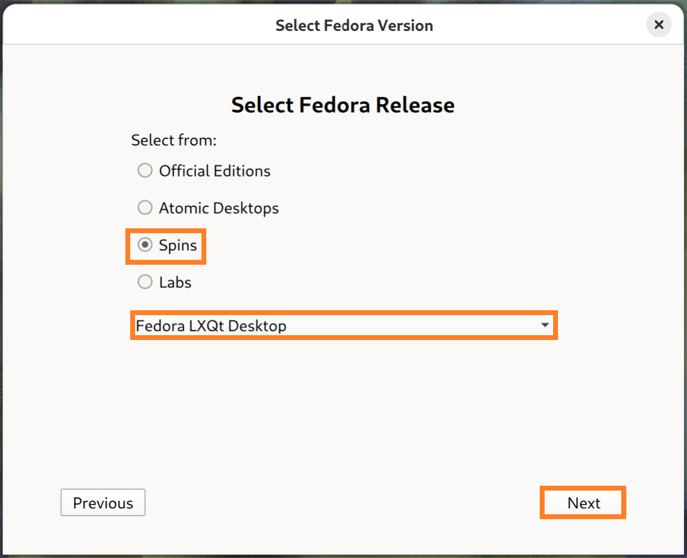
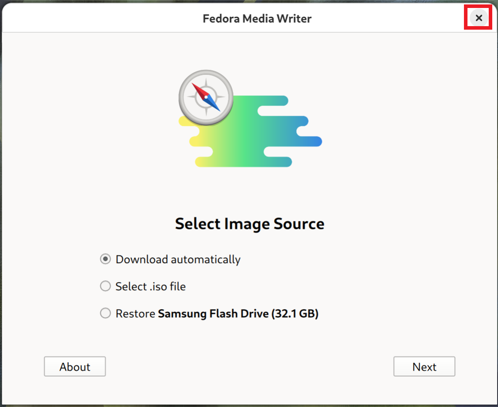

## Creating a Bootable USB on Linux

### USB Flash Drive

Insert a USB 3.0 Flash Drive. It should have a capacity >8 GB. This can be checked by opening up disks:

### Creating a Fedora Bootable USB

Press `⊞` to view the GNOME Dock and search for the Fedora Media Writer. The Fedora Media Writer is preinstalled on Fedora. On other distros such as Ubuntu, it will be available in the Software store as a snap package.

Launch the Fedora Media Writer:

Select Download automatically and select Next:

For the Official Edition with the GNOME Desktop Environment select Official Editions and Fedora WorkStation and then Next:

Alternatively select Spins and the desired Desktop Environment. For older hardware, the lightweight LXQt Desktop Environment is recommended:

Select the latest version, the 64 Bit Architecture and the appropriate USB Flash Drive. Select Download and Write:

The Fedora Media Writer requires root access and needs to be run as a super user. To run the application as a super user, an authentication prompt shows. To authenticate, the user password needs to be input:

The installation ISO will be downloaded and will be found in the Downloads folder and will be written to the USB Flash Drive:

The Fedora Media Writer can be closed:

### Note on Fedora Media Writer Partitioning

The Fedora Media Writer will create a single partition on the USB Flash Drive that matches the expected size of the ISO contents. The remainder of the USB Flash Drive will be unallocated space:

The Fedora Media Writer can restore the USB Flash Drive however the USB will be restored using the exFAT file system. The USB Flash Drive can be restored on Linux using GParted. For more details see [Restore USB on Linux](/.restore_usb_linux.md)