## Fedora Live USB

### Booting from a Fedora Bootable USB

Power up the Dell with the Fedora Bootable USB attached and press `F12` to get to the BIOS Boot Menu:

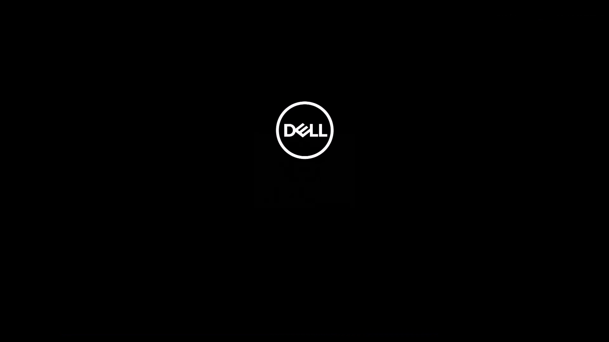

To the left hand side, select the Bootable USB:

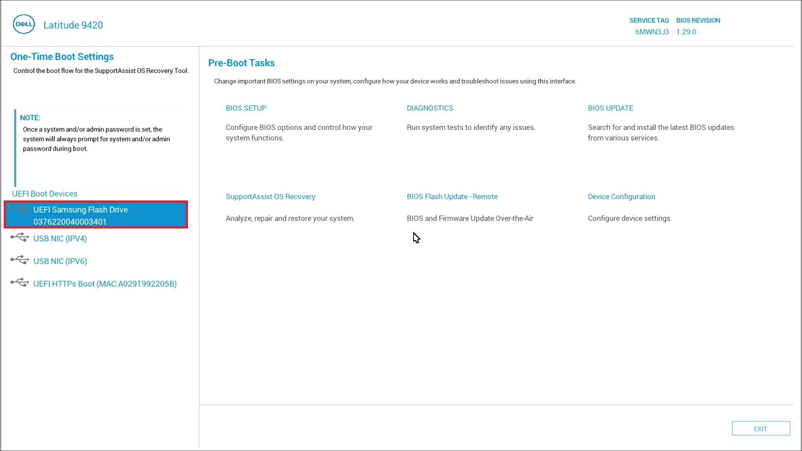

Select test this media & Start Fedora Live:

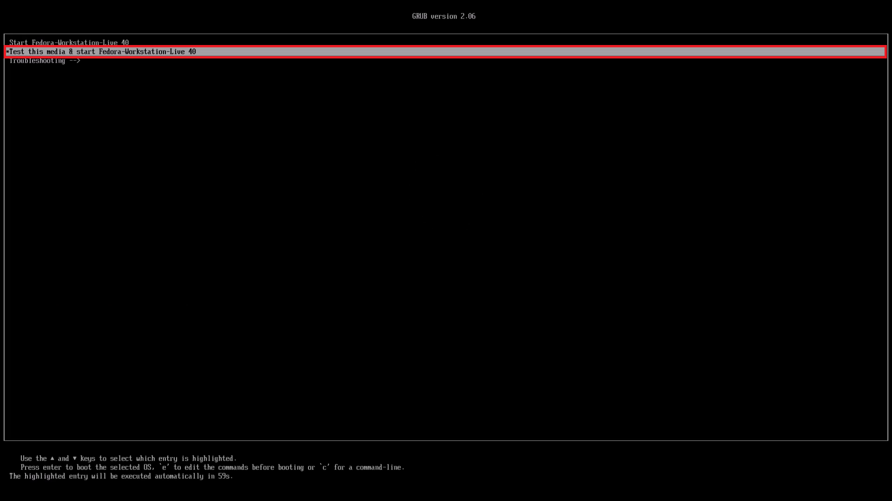

The Fedora Live environment essentially uses the Bootable USB as a storage drive and details about the background services being run in RAM will display:

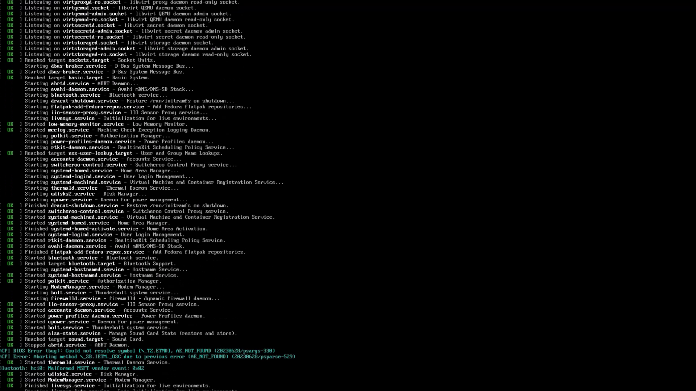

The Live GNOME Desktop Environment has a Dock and the installer is open by default:

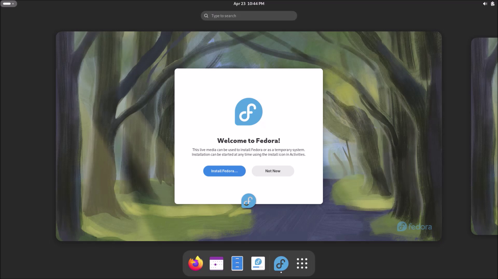

If the installer is selected, notice that it takes focus and the Dock disappears. Press `⊞` to view the GNOME Dock. This will take the application out of focus. All applications will be re-tiled so the open application of interest can be selected. The dock has the all applications button `𓃑`.

Select the installer and select install Fedora:

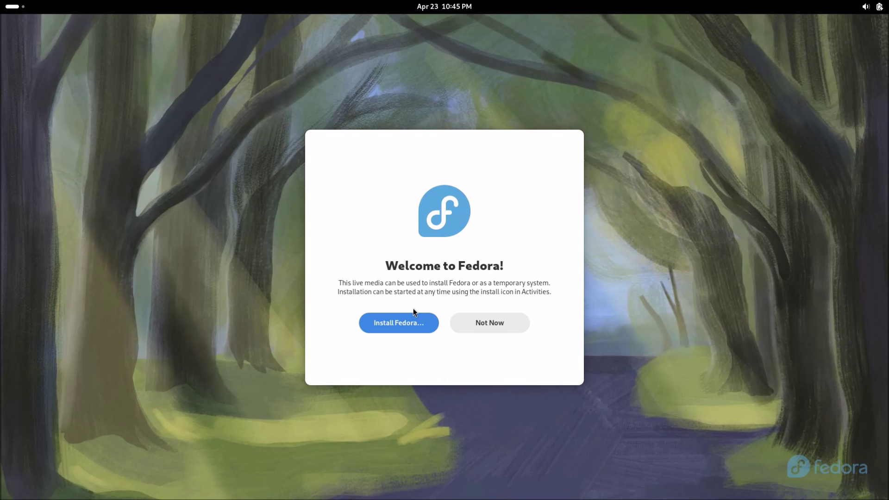

Select your language and regional variation and select Continue:

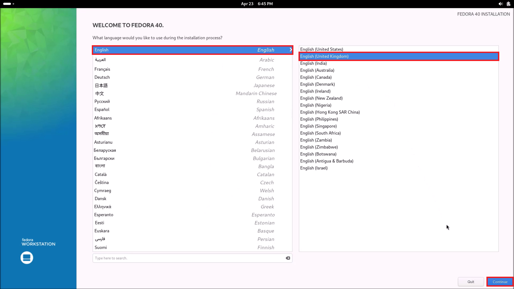

This will determine your Localisation and Time and Date Settings which can be further modified if desired on the next screen.

Select Installation Destination:

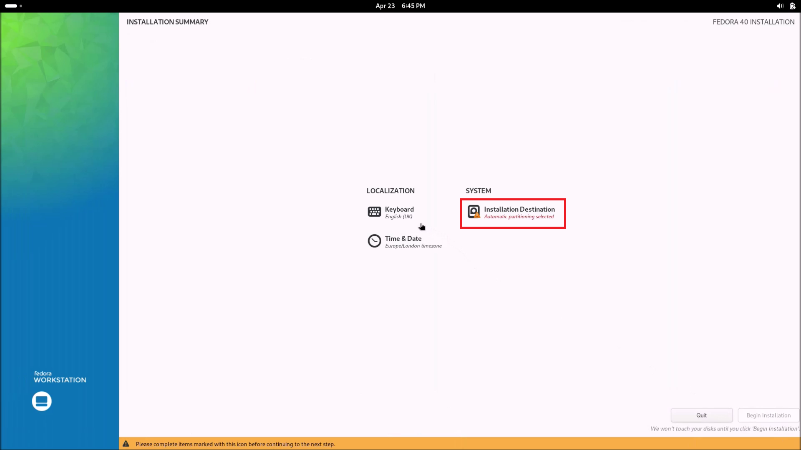

Notice that the internal NVMe SSD is selected, indicated by the black tick:

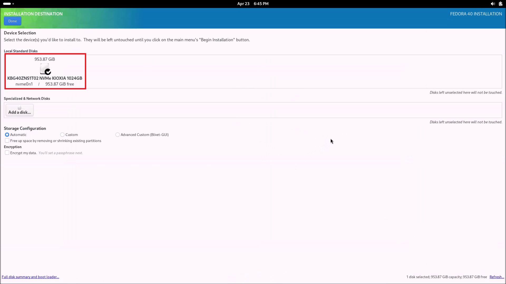

Note that selecting this again, unchecks the drive:

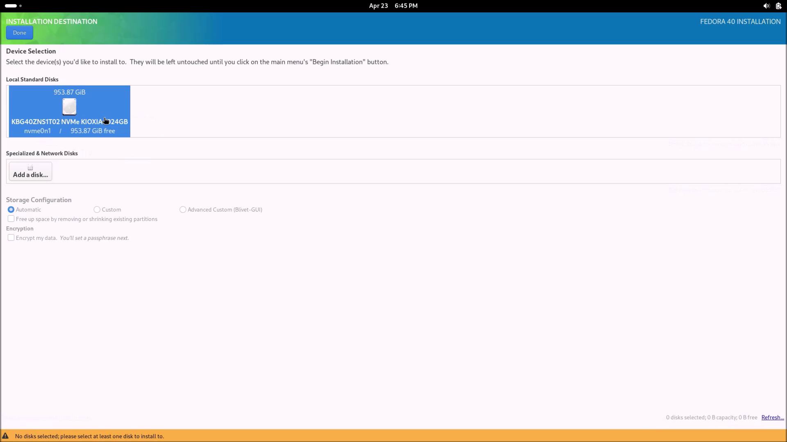

Selecting it again rechecks this drive and the black tick displays. Select Done:

Select Begin Installation:

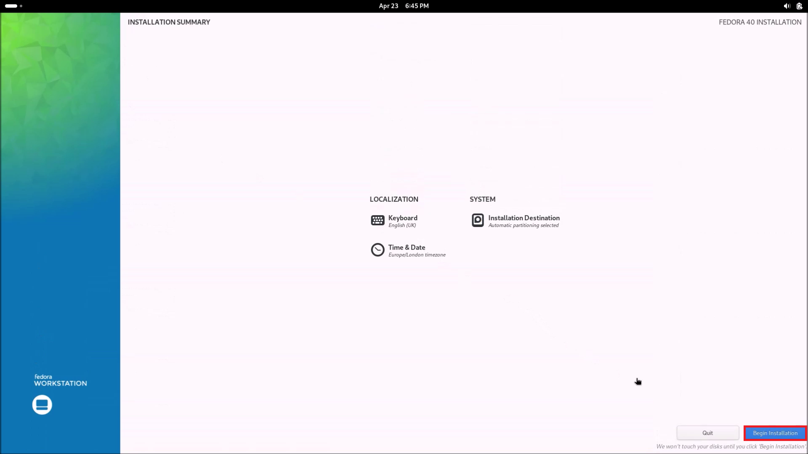

The installation will proceed. Select Finish Installation:

Note that the Live GNOME Desktop Environment is running and this is not the installed Desktop Environment. To exit it, go to the Power Menu and select Power Options:

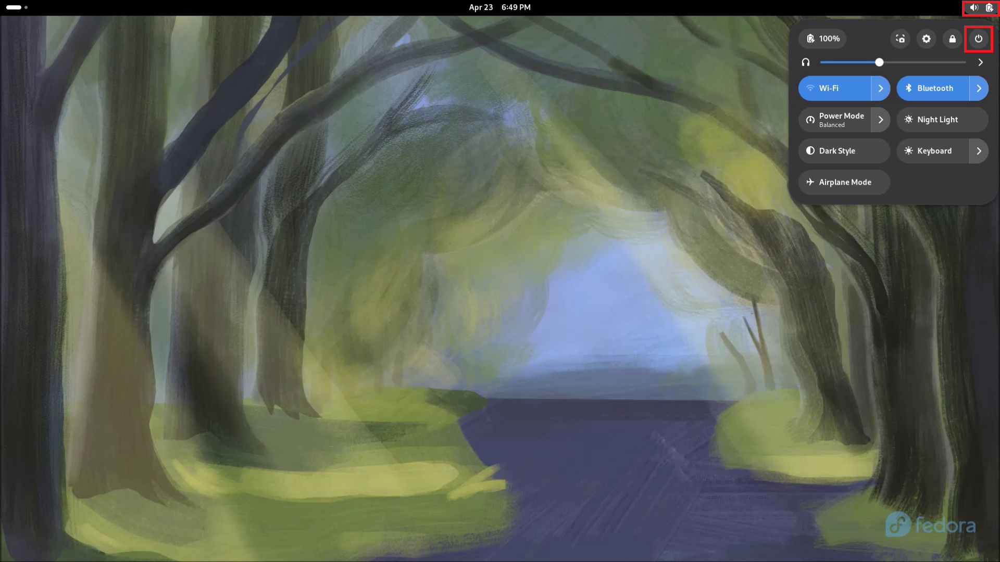

Select Restart:

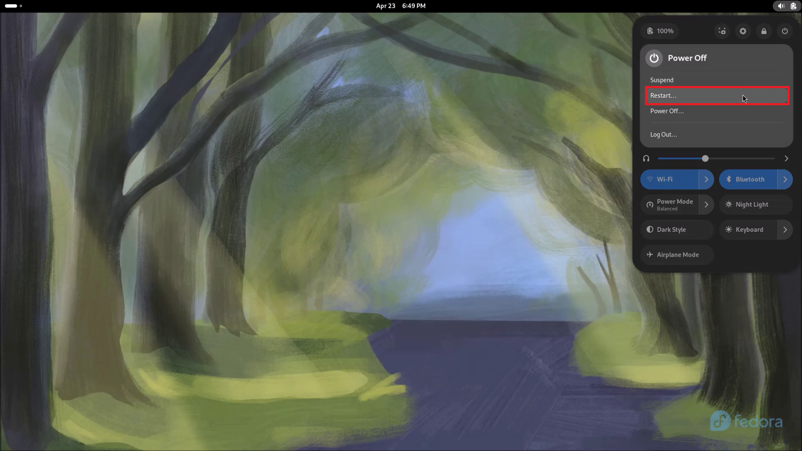

Select Restart:

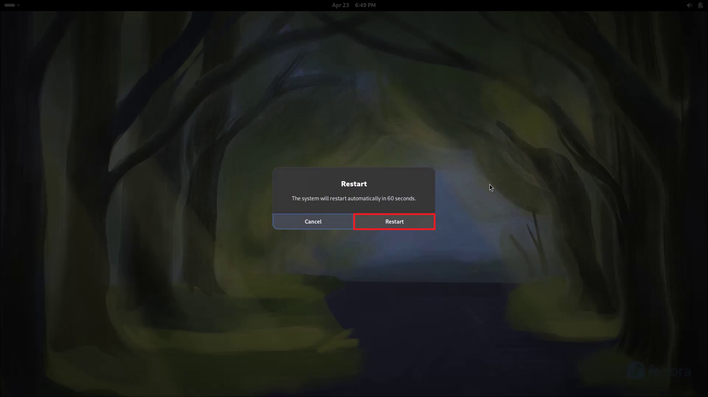

The system should now restart, taking you to the Fedora Out of the Box Experience. [Return to Fedora Installation](./readme.md)