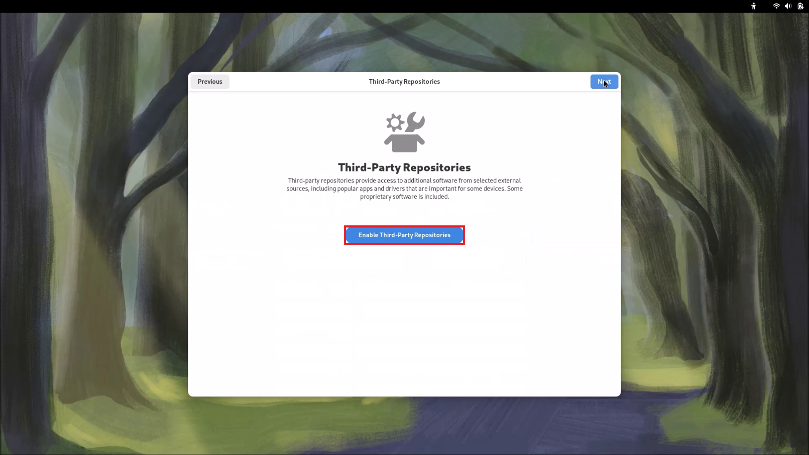
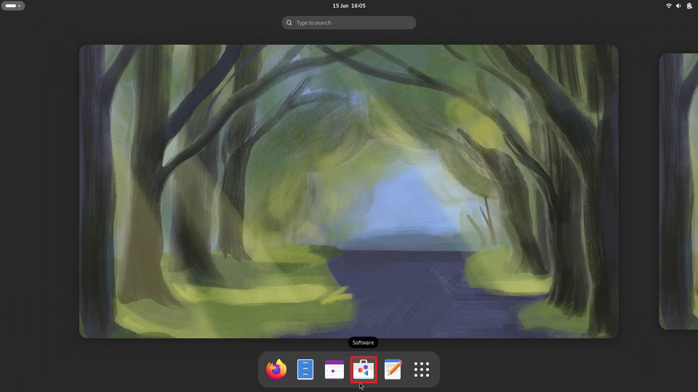

## OOBE Setup

### First Time Boot

The computer will reboot going to the OOBE Setup:

### Setup

The Fedora Boot Entry on the Internal Drive should take precedence over the Boot Entry on the Fedora Bootable USB and the Start Setup screen should display.

If the Install screen previously seen displays instead, you have booted using the Live USB again. If this happens go to the Power Menu and then Power Off. Then Power Off the PC, remove the Bootable USB and power up your PC.

Select Start Setup:

### Wireless Network

Select your WiFi network:

Input your Wireless Password and select Connect:

The tick should display beside your WIreless network, select Next:

### Privacy Settings

Select your Privacy Settings and select Next:

### Enable Third-Party Repositories

For software installation Fedora can use two package types RPMs and Flatpaks. However only the RPMs maintained by Fedora are enabled by default. Selecting Enable Third-Party Repositories will enable Flatpaks, as well as signed RPMs by vendors such as Google and NVIDIA which are closed-source.

Select Enable Third-Party Repositories:

Select Next:

### User Account

Input the:

* Full Name - this is the full name and can include lowercase and uppercase characters including spaces.
* Username - this is the folder name that corresponds to the user profile. It should be in lower case exclusive of spaces. 

and select next:

Input a password and confirm the password and select Next:

Select Start Using Fedora Linux:

### Software Update

Press `⊞` to display the GNOME Dock and applications screen. Select Software:

Select Updates:

Updates will list: 

* Firmware Updates: Including BIOS Updates, Device Firmware for Thunderbolt Docks
* Packages which are part of the OS
* RPM and Flatpak Packages that have updates

Select Restart and Update for the Software Updates:

Select Restart and Install:

The Computer will Restart:

For a Firmware Update select Update:

Select Restart when Prompted:

For a Thunderbolt Dock, each component of the Dock may be separately listed however should not be separately updated. 

Select Update to Update the Dock Firmware (this will update each of the components of the Dock cumulatively):

Select OK and unplug the Dock as instructed, wait a couple of minutes and then plug it back in:

### PC Name

Press `⊞` to display the GNOME Dock and applications screen. Select `𓃑` to get to all applications and select Terminal:

Notice the Terminal Prompt begins with:

`username@pcname`

The username is `philip` as specified during the install and the default `pcname` is`fedora`:

To change the 'pcname' press `⊞` to display the GNOME Dock and applications screen. Select Settings:

Select the System tab to the left and then select About at the bottom:

The default `pcname` of `fedora` shows:

Replace this with your desired `pcname` in this case `pc` and select the tick to apply:

When the system is rebooted the pcname will be updated:

[Return to Fedora Installation](./readme.md)