## Restore USB Windows

The Fedora Media Writer will create a single partition on the USB Flash Drive that matches the expected size of the ISO contents. The remainder of the USB Flash Drive will be unallocated space. While the Fedora Media Writer can Restore the USB, it will do so using the exFAT file system. To instead make a GPT Partition Table with a NTFS Partition, GParted can be used.

Press `⊞` to display the GNOME Dock and applications screen. Search for GParted. If it is not preinstalled. Open up software:

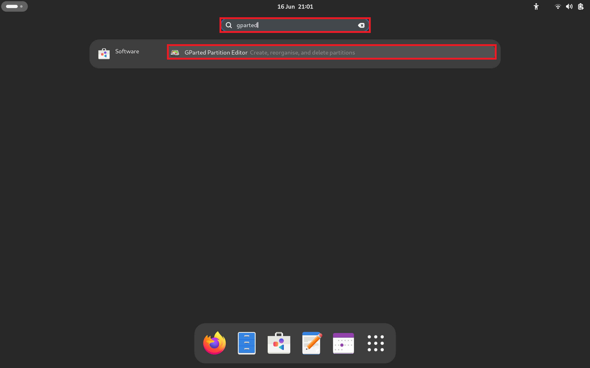

Select GParted:

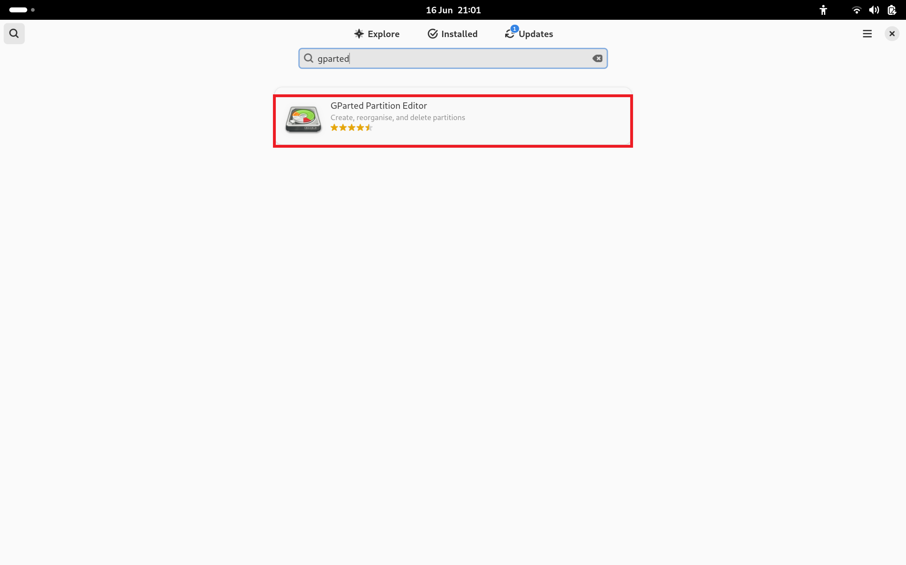

Select Install:

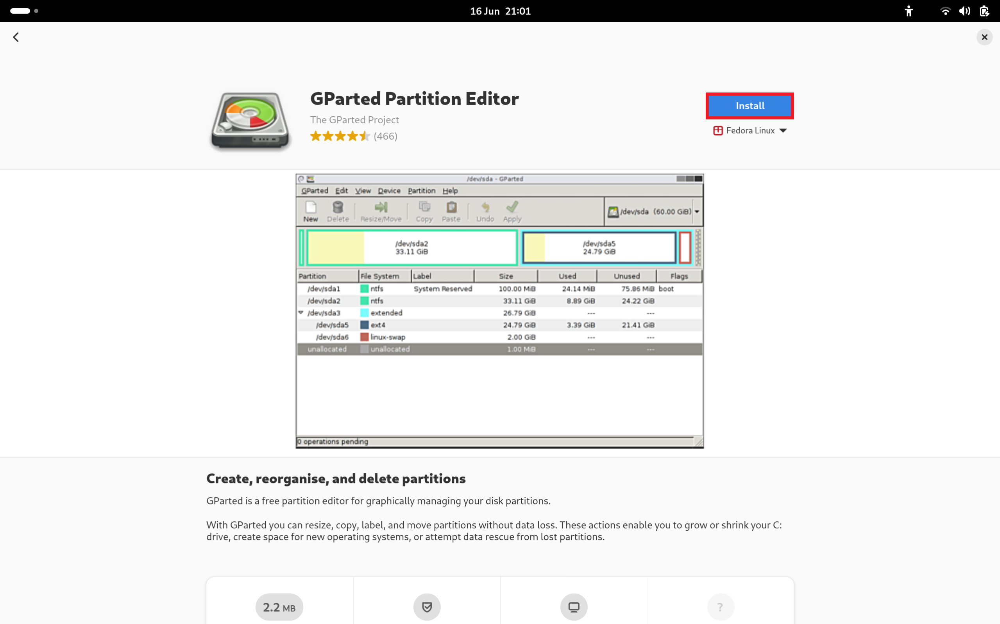

Select Open:

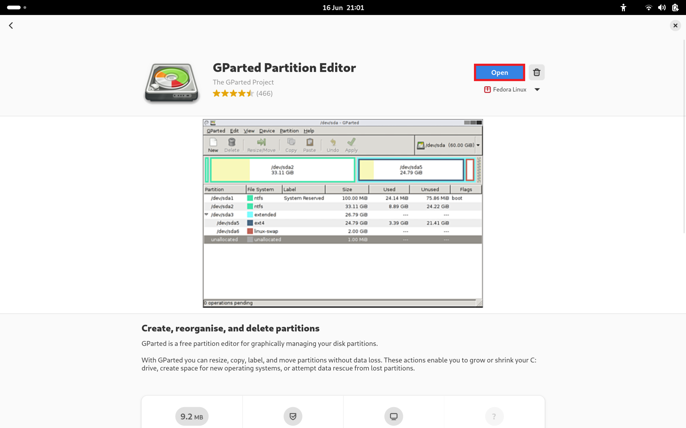

GParted needs elevated permissions to partition USB Flash Drives and needs to be run as a super user. The following Authentication Prompt will display, which is the Linux counterpart to Windows User Account Control. Input your password and select Authenticate:

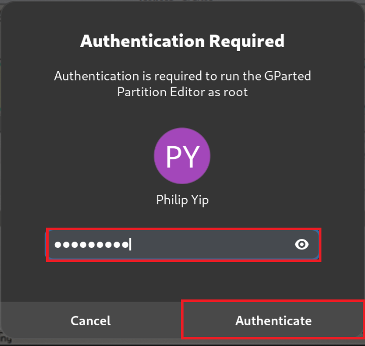

To the left select your USB Flash Drive:

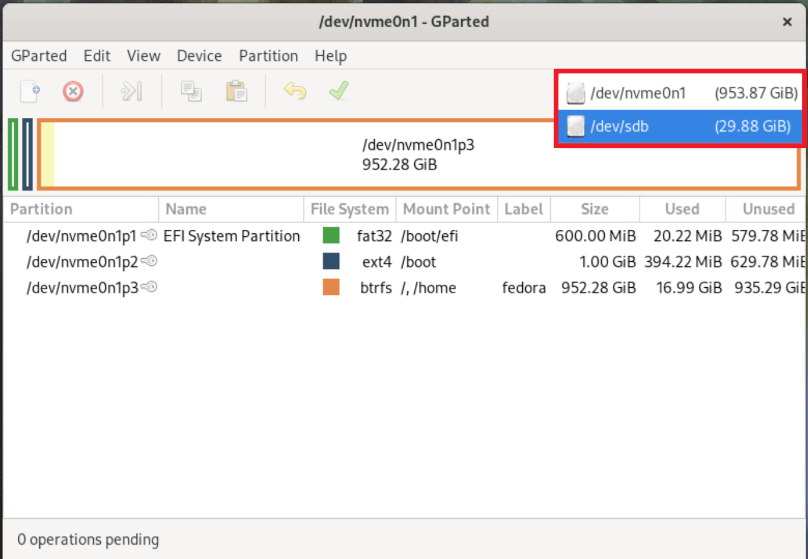

Select Device → Create Partition Table:

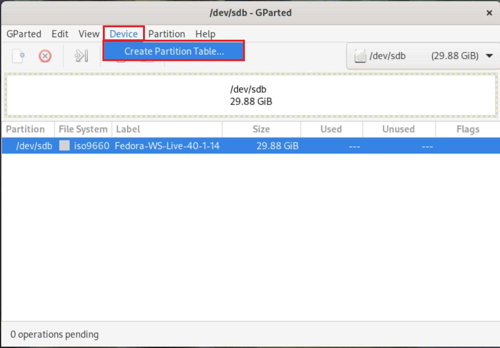

Select GPT:

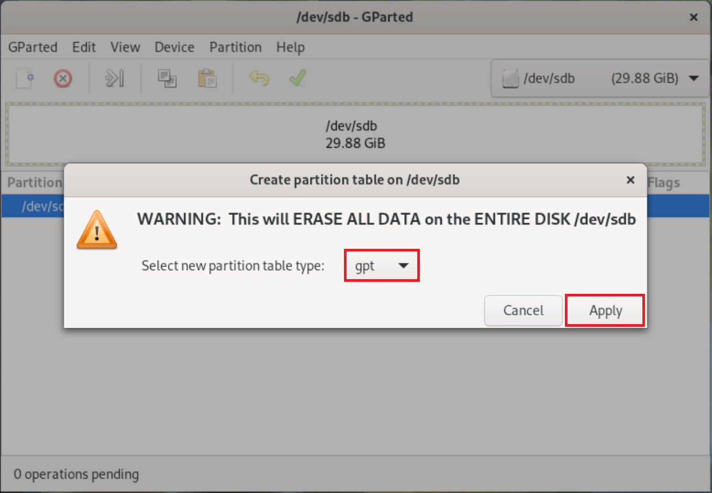

Right click unallocated space and select New:

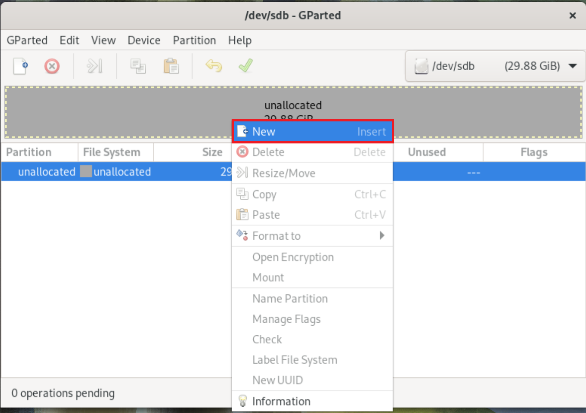

Use the default sizes to create a single partition which spans across the drive. Set the Partition Name to USB and Label to USB. Select Add:

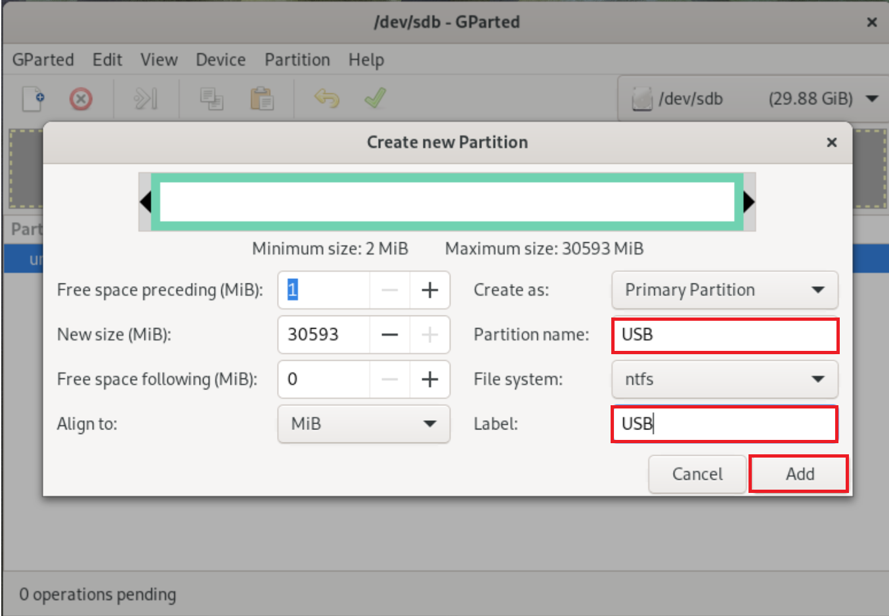

Select apply:

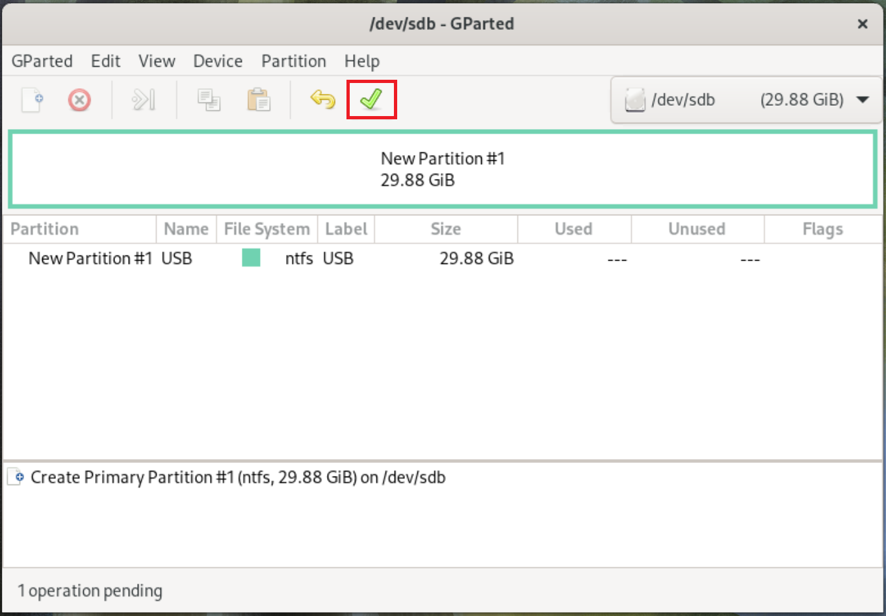

Select apply:

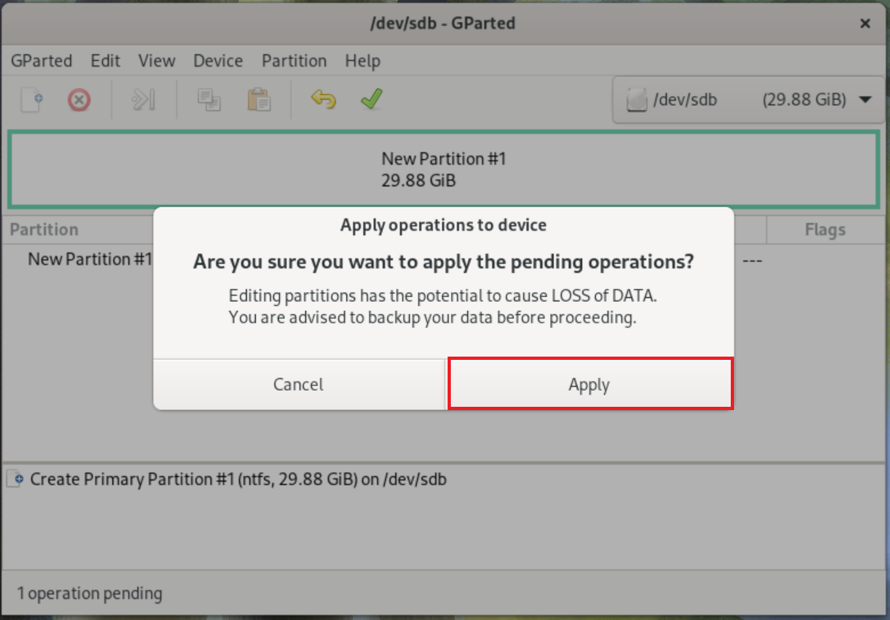

Select Close:

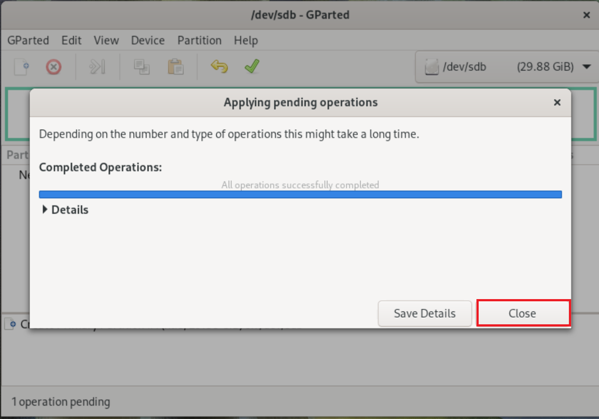

The USB Flash Drive is now has a GPT Partition Table with a single NTFS partition:

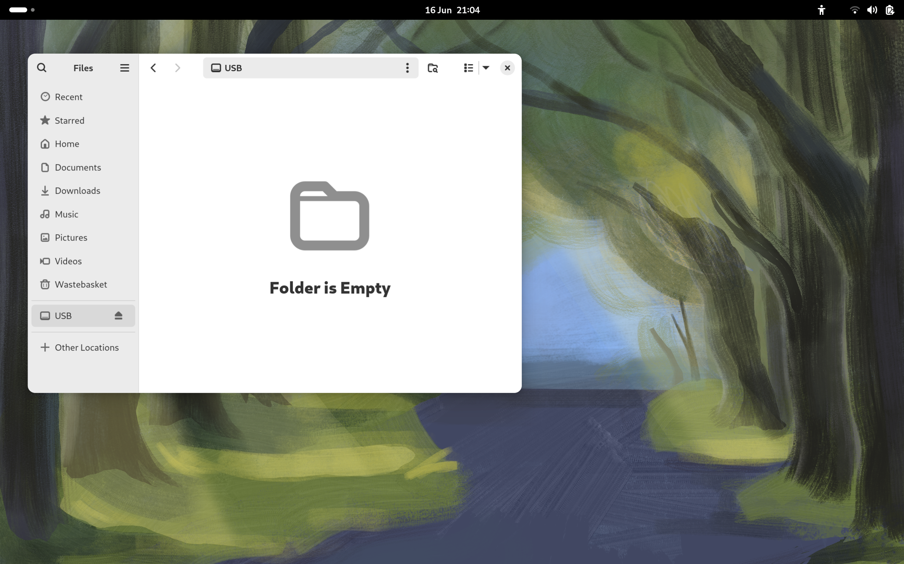

The USB Flash Drive now has a GPT Partition Table with a single NTFS Partition. [Return to Fedora Installation Guide](./readme.md).