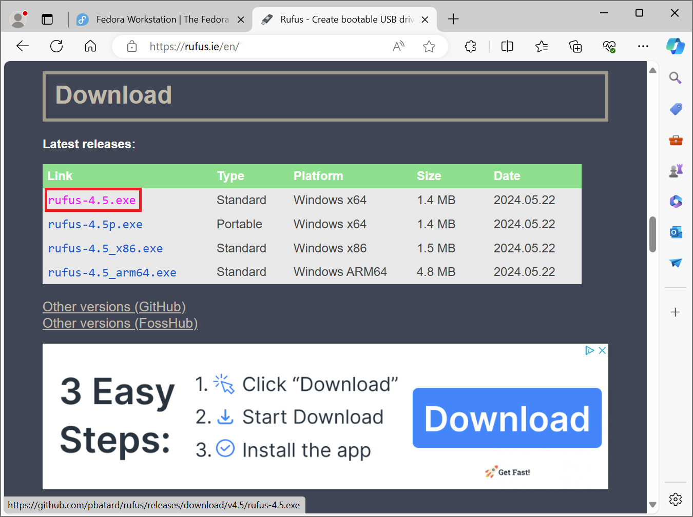
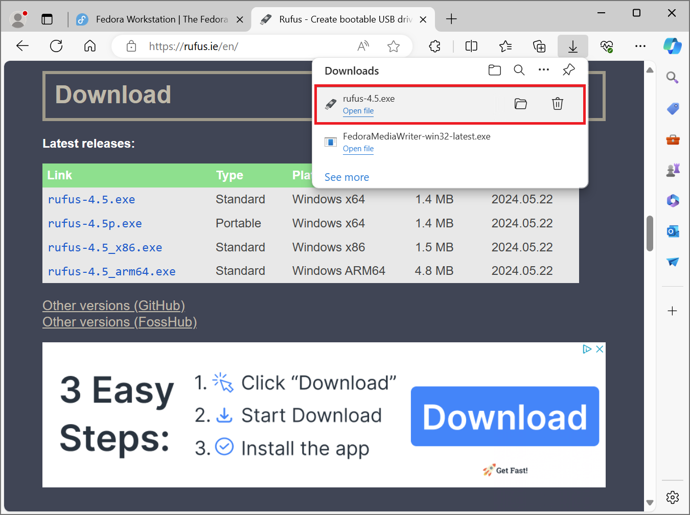
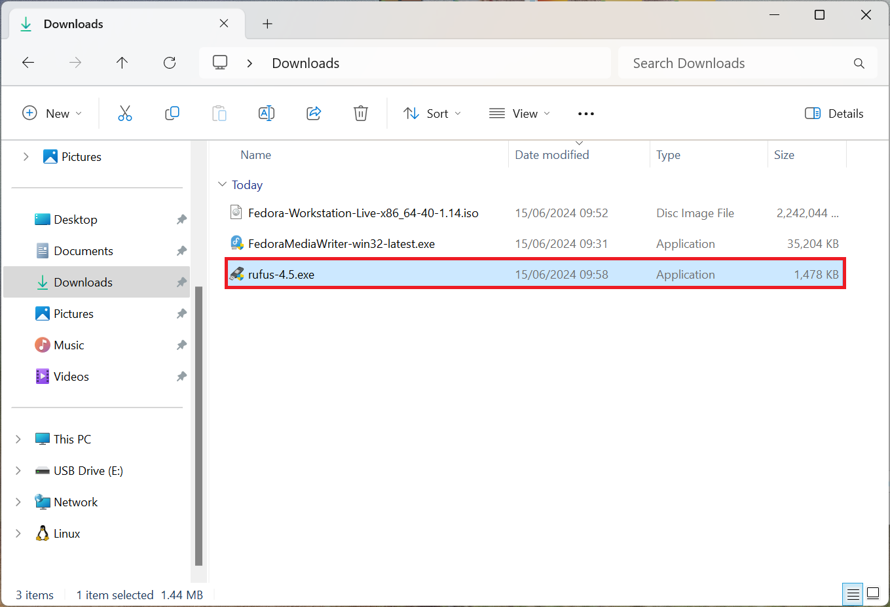
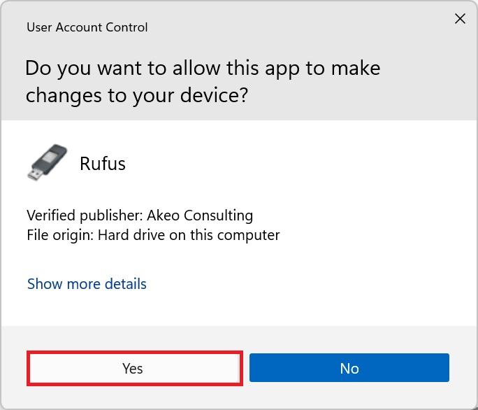
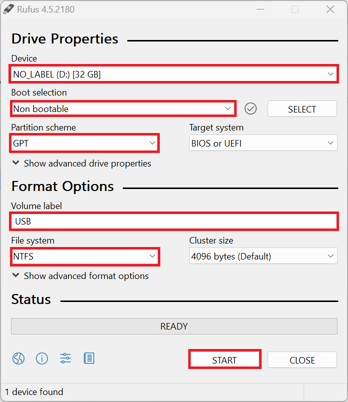
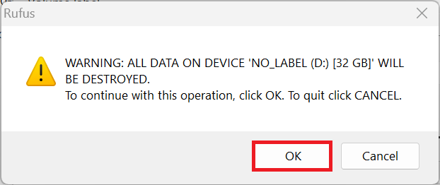
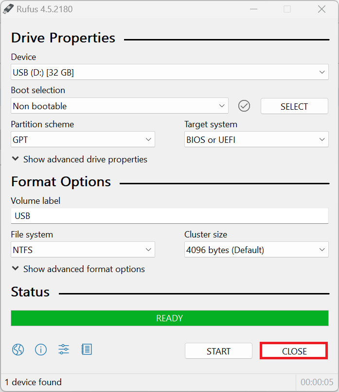

## Restore USB Windows

The Fedora Media Writer will create a single partition on the USB Flash Drive that matches the expected size of the ISO contents. The remainder of the USB Flash Drive will be unallocated space. While the Fedora Media Writer can Restore the USB, it will do so using the exFAT file system. To instead make a GPT Partition Table with a NTFS Partition, Rufus can be used.

Go to the [Rufus Download Page](https://rufus.ie/en/) and select the latest version of Rufus:

The Rufus application will be saved in the Downloads folder

Select Rufus:

Accept the User Account Control Prompt:

Select: 

* Device: Your USB Flash Drive
* Boot Selection: Non-Bootable
* Partition Table: GPT
* Volume Label: Input a Volume Label e.g. USB
* File System: NTFS

Then select Start:

Select OK:

Select Finish:

The USB Flash Drive now has a GPT Partition Table with a single NTFS Partition. [Return to Fedora Installation Guide](./readme.md).