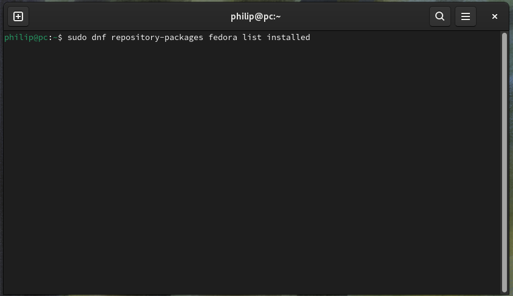
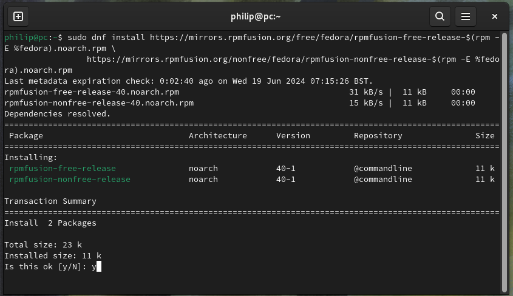
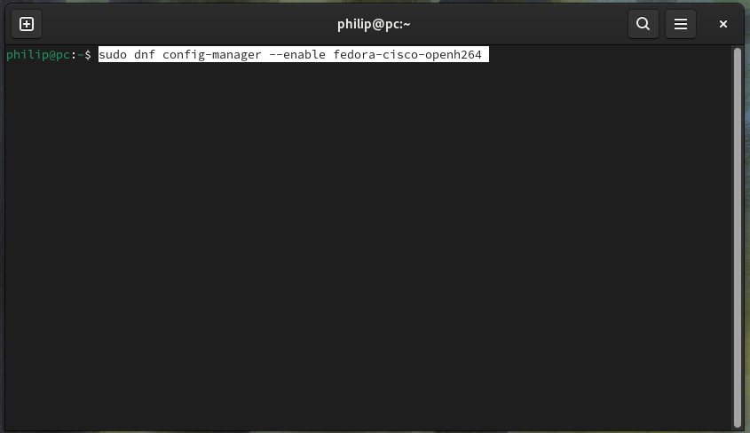
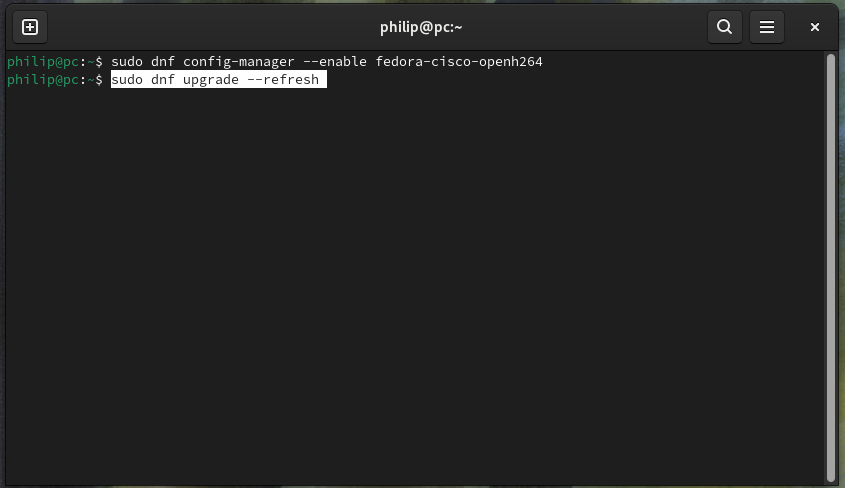
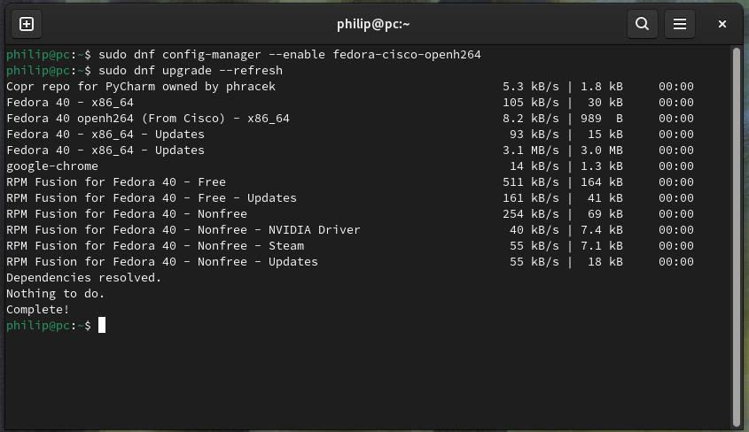

## RPM Fusion

### Fedora Repositories Overview

Fedora has a native package manager `dnf`. `dnf` packages are compartmentalised into a number of Repositories:

* Fedora  (Official Repository)
* RPM Fusion Free (Community Repository)
* RPM Fusion Non-Free (Community Repository)
* Google (Google Repository)
* NVIDIA (NVIDIA Repository)

Installing Fedora:

* Without Enabling third-party repositories enables the official Fedora Repository.
* Enabling third-party repositories the official Fedora Repository in addition to the Google and NVIDIA Repository. It also enables the `flathub` repository which uses another package manager `flatpak`.

The community repositories can optionally be manually enabled if additional drivers or multimedia codecs are required.

#### Fedora (Official Repository) - Open Source + Stable

The Linux Kernel and updates for the Linux Kernel are included in the official Fedora Repository. These includes a number of stable open-source drivers, developed jointly between chip manufacturers and kernel developers: 

* Intel*
* AMD*
* NVIDIA**
* Broadcom*
* Qualcomm*
* Realtek*

\* Since most hardware is manufactured by the vendors above, most hardware will work with the Linux kernel out of the box.

\*\* The official repository contains the open-source Nouveau driver which is essentially a driver reverse-engineered using limited information NVIDIA provide on their chips. 

#### Google (Google Repository)

The Google Repository contains Google software, most notably Google Chrome which is a Chromium based browser bundled with Google supplied multimedia codecs used for video streaming services.

Because physical media is on the decline in favour for streaming services. Google Chrome with its compartmentalised codes is often installed from this repository and there is no to configure additional system-wide multi-media codes.

#### NVIDIA Repository

The NVIDIA repository contains the closed-source NVIDIA driver which offers better performance than the open-source Nouveau driver as NVIDIA have all the details about their chips.

Closed-source code is code that has been obfuscated to hide confidential intellectual property. Closed-source cannot be reviewed by Linux Kernel developers and is therefore not included in the official repositories. 

In Fedora closed-source drivers are not signed to pass Secure Boot. Installation of the driver without signing when Secure Boot is enabled generally results in the closed-source NVIDIA driver being blocked and a rollback to the open-source Nouveau driver for the NVIDIA graphics card. Disable Secure Boot to use the NVIDIA driver or use the NVIDIA driver in the RPM Fusion Non-Free Repository. 

#### RPM Fusion Free Community Repository - Open Source and Development

The RPM Fusion Free repository is not enabled by default and includes development software that is not ready to be put in the official repository. This normally includes drivers that are being developed. Installation of these drivers will offer improved functionality but can introduce instabilities.

#### RPM Fusion Non-Free Community Repository - Closed Source

The RPM Fusion Non-Free repository includes proprietary software or software with restrictive licenses, such as closed-source multimedia codecs and closed-source drivers. Despite the name **Non-Free**, you are not charged by Fedora for use of this repository. Instead you have likely paid to use the features of the repository when you purchased a NVIDIA graphics card or a DVD.

The NVIDIA driver in the Non-Free repository has been further tested by the Fedora Community. Additional packages are included in this repository to pair this driver with a Machine Owner Key in order to pass Secure Boot.

### Fedora Package Manager (dnf)

The Linux Terminal and the Fedora package manager will be used extensively below:

* Recall prefixing a command with ```sudo``` is an instruction to run the command as a super user with elevated privileges. ```sudo``` is an abbreviation for super suer do.
* ```dnf``` is the name of the package manager which is an abbreviation for dandified yum. ```yum``` was the original package manager which was an abbreviation for yellowdog update manager.

To install a single package, the following syntax is used:

```bash
sudo dnf install package1
```

Multiple packages can be installed:

```bash
sudo dnf install package1 package2
```
```\``` can be used to split a command over multiple lines, this can sometimes be done to make the code more readible:

```bash
sudo dnf install package1 \
                 package2
```

### Enabling the RPM Fusion Repositories

Press `⊞` to view the GNOME Dock. Select the all applications button `𓃑` and then select Terminal:


For convenience the code in the guide can be copied and pasted into the Terminal. Recall a touchpad may be configured to use a two finger press in place of a right click:


The repositories (channels used by dnf to look for packages) can be listed using:

```bash
 sudo dnf repolist
```

Since the command is prefixed with `sudo`, an authentication prompt will be shown, supply the user password to proceed:


The repositories used will be listed. The terminal can be cleared using:

```bash
clear
```


The packages installed from the fedora repository can be listed using:

```bash
sudo dnf repository-packages list installed
```



The following packages are installed out of the box:


Both RPM Fusion Community repositories can be enabled using:

```bash
sudo dnf install https://mirrors.rpmfusion.org/free/fedora/rpmfusion-free-release-$(rpm -E %fedora).noarch.rpm \
                 https://mirrors.rpmfusion.org/nonfree/fedora/rpmfusion-nonfree-release-$(rpm -E %fedora).noarch.rpm
```


Input `y` in order to proceed:



The repositories are now added:


The Fedora Cisco Openh264 repository should also be enabled:

```bash
sudo dnf config-manager --enable fedora-cisco-openh264
```



Once the repositories are added, a search for updates should be made:

```bash
sudo dnf upgrade --refresh 
```





### Multimedia Codecs

GStreamer is a preinstalled multimedia framework that provides Operating System wide plugins for handling various multimedia formats. These plugins are grouped into:

* *Good Plugins* are stable, well-maintained plugins for common multimedia task
* *Bad Plugins* are under development or with potential legal or technical issues
* *Ugly Plugins* are plugins for formats that may have legal restrictions or patents

To install the additional plugins from the rpmfusion repositories use:

```bash
sudo dnf install gstreamer1-plugins-good-extras \
                 gstreamer1-plugins-bad-free-extras \
                 gstreamer1-plugins-ugly gstreamer1-plugins-ugly-free \
                 gstreamer1-vaapi \
                 rpmfusion-free-release-tainted \
                 lame faad2 faac
```


Input `y` at each prompt in order to proceed:


The multimedia codecs are now installed:


The libdvdcss for dvd playback, requires rpmfusion-free-release-tainted as a dependency and can now be installed:

```bash
sudo dnf install libdvdcss
```


Input `y` in order to proceed:


The packages installed from each repository can be listed:

```bash
sudo dnf repository-packages fedora list
```
```bash
sudo dnf repository-packages rpmfusion-free list
```
```bash
sudo dnf repository-packages rpmfusion-nonfree list
```


### Checking Hardware

The list pci command can be used to view details about a systems PCI devices in a scrolling output:

```bash
sudo lspci -v | less
```


Use the arrow key `↓` to scroll down. Details about the processor will be listed:


Details about the video controlled will be listed. The video card has multiple kernel modules (drivers):

> kernel modules: i915, xe

i915 is the current driver and should be the driver in use by default. xe is an experimental driver under development:

> Kernel Driver in use: i915

A NVIDIA video card will list multiple kernel (drivers):

> kernel modules: nouveau, nvidia

And the default driver in use will be the open-source driver nouveau which lacks some performance over the closed-source nvidia driver:

> Kernel Driver in use: nouveau


Press `q` to quit the scrolling output:


This will return back to the Terminal prompt:


In the case of a NVIDIA card the kernel modules will list nouveau and the default driver in use will be nouveau:

### Intel Processor

For an Intel Processor, the following packages can be installed:

* thermald monitors and controls CPU temperature and prevents overheating.
* tlp is a power management tool for Linux, which optimizes battery life for laptops.
* powertop is a utility to diagnose issues with power consumption and provide suggestions to improve power usage. 
* perf is a performance analysing tool in the Linux kernel.
* kernel-tools assist with kernel development and management.

using the command:

```bash
sudo dnf install thermald \
                 tlp \
                 powertop \
                 perf \
                 kernel-tools \
```


Input `y` in order to proceed:


These packages are now installed:


### Intel Video

For an Intel video card, the following packages can be installed:

* intel-media-driver is A VAAPI (Video Acceleration API) driver that supports video hardware acceleration on Intel GPUs.
* intel-gpu-tools is a set of tools for debugging and performance monitoring of Intel graphics cards. 
* libva-utils is a collection of utilities for the Video Acceleration API (VAAPI), which helps in testing and verifying the functionality of VAAPI drivers.
* mesa-vulkan-drivers for the Mesa 3D Graphics Library for Intel GPUs, enabling Vulkan API support.
* mesa-dri-drivers for Direct Rendering Infrastructure (DRI) drivers provided by Mesa for hardware-accelerated graphics rendering.
* mesa-libGL are mesa 3D Graphics Library implementation of the OpenGL API, providing essential functions for rendering 2D and 3D graphics.
* mesa-libEGL are the Mesa implementation of the EGL API, which interfaces between rendering APIs like OpenGL ES and the native windowing system.
* mesa-libgbm is the Generic Buffer Management (GBM) library, part of Mesa, used for managing graphics buffers in memory.
* libdrm is the Direct Rendering Manager (DRM) library, which provides an interface to the kernel-level DRM services, essential for direct rendering operations.
* sysstat is a collection of performance monitoring tools for Linux.


```bash
sudo dnf install xorg-x11-drv-intel \
                 intel-media-driver \
                 intel-gpu-tools \
                 libva-utils \
                 mesa-vulkan-drivers \
                 mesa-dri-drivers \
                 mesa-libGL \
                 mesa-libEGL \
                 mesa-libgbm \
                 libdrm \
                 sysstat
```

using the command:


Input `y` in order to proceed:


These packages are now installed:


### NVIDIA Video

NVIDIA video will use the open source Nouveau driver by default which has limited performance. The NVIDIA driver supports NVIDIA cards manufactured post 2014. The NVIDIA driver can be found in multiple locations:

1. NVIDIA website (.run file)
2. NVIDIA repository
3. RPM Fusion Non-Free Community repository

It is not recommended to use the NVIDIA .run file however its landing page can be examined to see the [supported products](https://www.nvidia.com/download/driverResults.aspx/218153/).


It is easier to configure a Machine Owner Key using the NVIDIA driver from the RPM Fusion Non-Free Community repository which is the approach outlined below.

#### Installing the NVIDIA RPM Fusion Driver

Install the NVIDIA driver and dependencies from the RPM Fusion repositories using:

```bash
sudo dnf install gcc \
                 kernel-headers \
                 kernel-devel \
                 akmod-nvidia \
                 xorg-x11-drv-nvidia \
                 xorg-x11-drv-nvidia-cuda \
                 xorg-x11-drv-nvidia-libs \
                 xorg-x11-drv-nvidia-libs.i686 \
                 libva-nvidia-driver
```


Input `y` in order to proceed:


The driver is now installed:


Forcefully rebuild and reinstall kernel modules provided by akmod packages:

```bash
sudo akmods --force
```


This may take a while and the Terminal will be busy:


When its done, ok will show:


Forcefully regenerate the initial ramdisk (initramfs):

```bash
sudo dracut --force 
```


This may take a while and the Terminal will be busy:


When its done, a new prompt will show:


#### Signing the NVIDIA Driver from RPM Fusion

Now generate a signing key:

```bash
openssl req -new -x509 -newkey rsa:2048 -keyout MOK.key -out MOK.crt -nodes -days 36500 -subj "/CN=My NVIDIA Module Signing/"
```


The following output will show:


Next convert the certificate:

```bash
openssl x509 -in MOK.crt -outform DER -out MOK.der
```


Then sign the NVIDIA Kernel Modules, entering each of the four lines:

```bash
sudo /usr/src/kernels/$(uname -r)/scripts/sign-file sha256 MOK.key MOK.crt $(modinfo -n nvidia)
```
```bash
sudo /usr/src/kernels/$(uname -r)/scripts/sign-file sha256 MOK.key MOK.crt $(modinfo -n nvidia_drm)
```
```bash
sudo /usr/src/kernels/$(uname -r)/scripts/sign-file sha256 MOK.key MOK.crt $(modinfo -n nvidia_modeset)
```
```bash
sudo /usr/src/kernels/$(uname -r)/scripts/sign-file sha256 MOK.key MOK.crt $(modinfo -n nvidia_uvm)
```


Now enroll the key:

```bash
sudo mokutil --import MOK.der
```


Create and confirm a password. This one-time password will need to be supplied to the BIOS when the system reboots:


Reboot using:

```bash
sudo reboot
```

You will be taken to the UEFI BIOS MOK Management screen:


Press the `↓`` key until you get to Enroll MOK and then press `↵``:


Press the `↓` key until you get to Continue and then press `↵`:


You will be asked, whether you want to enrol the keys. Press the `↓` key until you get to Yes and then press `↵`:


Input the Machine Owner Key (Secure Boot Password) that you created earier and then press `↵`. Note that the box does not display any characters or * as you type.


If the password is accepted, you will not see any confirmation and instead just see this screen. Reboot should be highlighted, press `↵`:


If the Machine Owner Key does not match the Secure Boot Password you will be warned and be prompted to input it again.

[Return to Fedora Installation Guide](./readme.md).