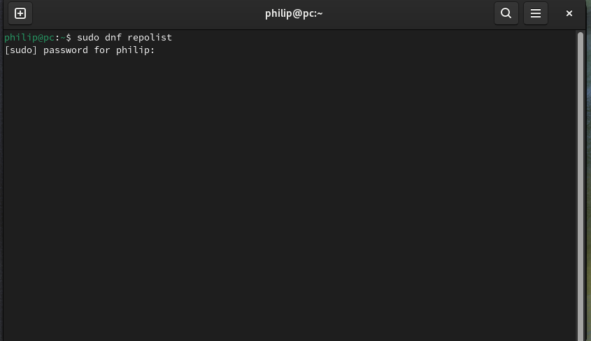
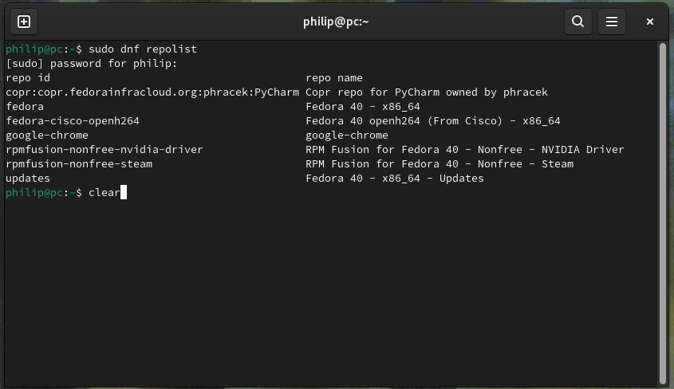
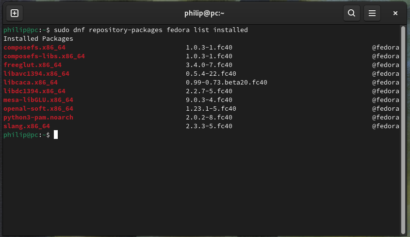
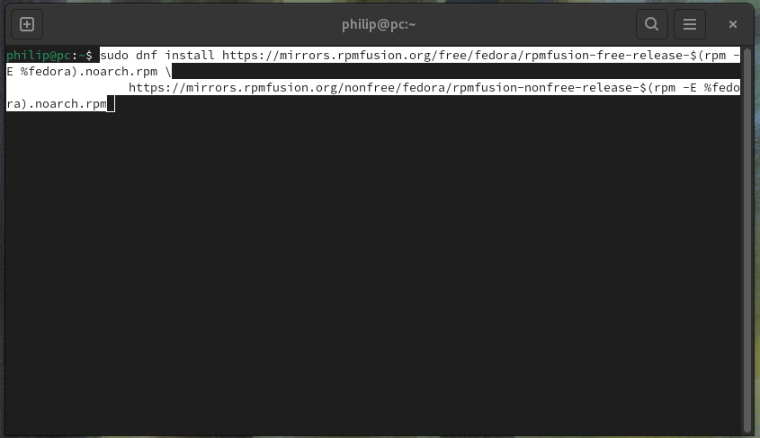
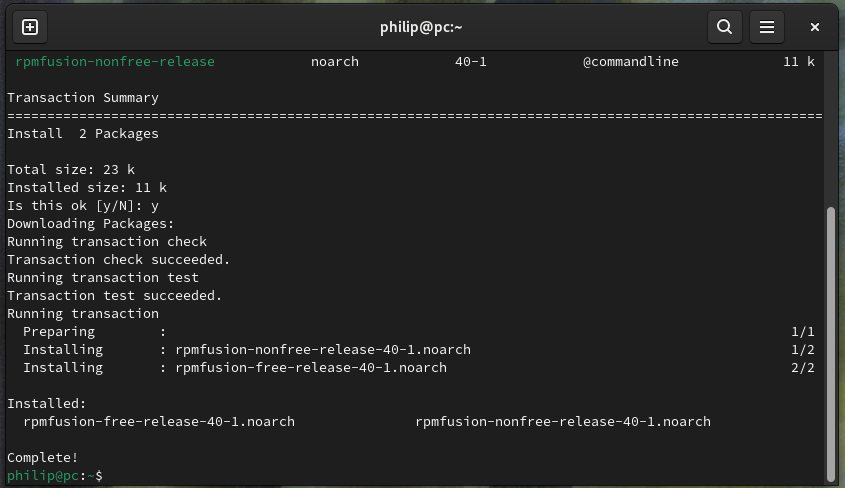
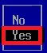

## RPM Fusion

### Linux Kernel

The Linux Kernel includes a number of stable open-source drivers developed jointly between chip manufacturers and kernel developers: 

* Intel → Open Source + Kernel Drivers
* AMD → Open Source + Kernel Drivers
* Broadcom → Open Source + Kernel Drivers
* Qualcomm → Open Source + Kernel Drivers 
* Realtek → Open Source + Kernel Drivers 

Since most hardware is manufactured by the vendors above, most hardware will work with the Linux kernel out of the box.

### RPM Fusion

RPM Fusion is a number of third-party software repositories for Fedora, providing additional drivers and multimedia codecs that are not included in the official Fedora repositories usually due to the software being closed-source, under-development or having some sort of licensing restrictions. RPM Fusion includes:

* Development drivers, which may be unstable and therefore are not installed by default.
* Closed-source drivers, because these are closed-source Linux Kernel developers cannot review them for code quality

Closed-source drivers are provided by manufacturers however their code is obfuscated to hide confidential intellectual property. As the quality of obfuscated drivers cannot be reviewed for code quality or further tweaked for performance it is not included in the Linux Kernel. One notable chip manufacturer releases closed-source obfuscated drivers:

* NVIDIA → Closed Source

The Linux kernel therefore does not include the closed-source driver provided by NVIDIA but instead includes the open-source Nouveau which is essentially a driver reverse-engineered using limited information NVIDIA provide on their chips. Because the Linux Kernel developers have limited information on the chips, the reverse-engineered open-source driver does not perform as well as the closed-source driver developed by NVIDIA.

#### Secure Boot

RedHat only signs the Linux kernel or open-source drivers is RPM Fusion. Unsigned drivers do not pass Secure Boot by default and require creation of a Machine Owner Key or Disabling of Secure Boot.


### dnf Fedora Package Manager

The Linux Terminal and the Fedora package manager will be used extensively below:

* Recall prefixing a command with ```sudo``` is an instruction to run the command as a super user with elevated privileges. ```sudo``` is an abbreviation for super suer do.
* ```dnf``` is the name of the package manager which is an abbreviation for dandified yum. ```yum``` was the original package manager which was an abbreviation for yellowdog update manager.

To install a single package, the following syntax is used:

```bash
sudo dnf install package1
```

Multiple packages can be installed:

```bash
sudo dnf install package1 package2
```
```\``` can be used to split a command over multiple lines, this can sometimes be done to make the code more readible:

```bash
sudo dnf install package1 \
                 package2
```

### Enabling the RPM Fusion Repositories

Press `⊞` to view the GNOME Dock. Select the all applications button `𓃑` and then select Terminal:


For convenience the code in the guide can be copied and pasted into the Terminal. Recall a touchpad may be configured to use a two finger press in place of a right click:


The repositories (channels used by dnf to look for packages) can be listed using:

```bash
 sudo dnf repolist
```

Since the command is prefixed with `sudo`, an authentication prompt will be shown, supply the user password to proceed:



The repositories used will be listed. The terminal can be cleared using:

```bash
clear
```



The packages installed from the fedora repository can be listed using:

```bash
sudo dnf repository-packages list installed
```


The following packages are installed out of the box:



The RPM Fusion Free repository contains open-source software that adheres that are entirely open-source and free to use, modify, and distribute. The RPM Fusion Non-Free repository includes proprietary software or software with restrictive licenses, such as closed-source codecs and  closed-source drivers. The closed-source code in RPM Fusion Non-Free, can be used by the user without paying. Non-free generally means the software in the repository is closed-source. Closed source means the code used to develop a package is obfuscated by the developer to protect their own intellectual property. It is not included in Fedora because it cannot be audited by Linux Kernel developers for code quality. Both repositories can be enabled using:

```bash
sudo dnf install https://mirrors.rpmfusion.org/free/fedora/rpmfusion-free-release-$(rpm -E %fedora).noarch.rpm \
                 https://mirrors.rpmfusion.org/nonfree/fedora/rpmfusion-nonfree-release-$(rpm -E %fedora).noarch.rpm
```



Input `y` in order to proceed:


The repositories are now added:



The Fedora Cisco Openh264 repository needs to be enabled:

```bash
sudo dnf config-manager --enable fedora-cisco-openh264
```


Once the repositories are added, a search for updates should be made:

```bash
sudo dnf upgrade --refresh 
```


### Multimedia Codecs

GStreamer is a preinstalled multimedia framework that provides plugins for handling various multimedia formats. These plugins are grouped into:

* *Good Plugins* are stable, well-maintained plugins for common multimedia task
* *Bad Plugins* are under development or with potential legal or technical issues
* *Ugly Plugins* are plugins for formats that may have legal restrictions or patents

To install the additional plugins from the rpmfusion repositories use:

```bash
sudo dnf install gstreamer1-plugins-good-extras \
                 gstreamer1-plugins-bad-free-extras \
                 gstreamer1-plugins-ugly gstreamer1-plugins-ugly-free \
                 gstreamer1-vaapi \
                 rpmfusion-free-release-tainted \
                 lame faad2 faac
```


Input `y` at each prompt in order to proceed:


The multimedia codecs are now installed:


The libdvdcss for dvd playback, requires rpmfusion-free-release-tainted as a dependency and can now be installed:

```bash
sudo dnf install libdvdcss
```


Input `y` in order to proceed:


The packages installed from each repository can be listed:

```bash
sudo dnf repository-packages fedora list
```
```bash
sudo dnf repository-packages rpmfusion-free list
```
```bash
sudo dnf repository-packages rpmfusion-nonfree list
```


### Checking Hardware

The list pci command can be used to view details about a systems PCI devices in a scrolling output:

```bash
sudo lspci -v | less
```


Use the arrow key `↓` to scroll down. Details about the processor will be listed:


Details about the video controlled will be listed. The video card has multiple kernel modules (drivers):

> kernel modules: i915, xe

i915 is the current driver and should be the driver in use by default. xe is an experimental driver under development:

> Kernel Driver in use: i915

A NVIDIA video card will list multiple kernel (drivers):

> kernel modules: nouveau, nvidia

And the default driver in use will be the open-source driver nouveau which lacks some performance over the closed-source nvidia driver:

> Kernel Driver in use: nouveau


Press `q` to quit the scrolling output:


This will return back to the Terminal prompt:


In the case of a NVIDIA card the kernel modules will list nouveau and the default driver in use will be nouveau:

### Intel Processor





#### Intel Processor

For an Intel Processor, the following packages can be installed:

```bash
sudo dnf install thermald \
                 tlp \
                 powertop \
                 perf \
                 kernel-tools \
```

#### Intel Video

For an Intel video card, the following packages can be installed:

```bash
sudo dnf install xorg-x11-drv-intel \
                 intel-media-driver \
                 intel-gpu-tools \
                 libva-utils \
                 mesa-vulkan-drivers \
                 mesa-dri-drivers \
                 mesa-libGL \
                 mesa-libEGL \
                 mesa-libgbm \
                 libdrm \
                 sysstat \
```

#### The NVIDIA Driver

The NVIDIA driver supports NVIDIA cards manufactured post 2014. The NVIDIA driver can be found in multiple locations:

1. NVIDIA website (.run file)
2. NVIDIA repository
3. RPM Fusion Non-Free repository

It is not recommended to use the NVIDIA .run file however its landing page can be examined to see the [supported products](https://www.nvidia.com/download/driverResults.aspx/218153/).

Although the NVIDIA and FlatPak repositories can be enabled during Fedora's OOBE setup. It should be noted that the driver does not pass Secure Boot and a Machine Owner Key needs to be created. It is slightly easier to configure a Machine Owner Key using the NVIDIA driver from RPMFusion.

##### Installing the NVIDIA RPM Fusion Driver

Check details:

```
modinfo nouveau
modinfo nvidia
```

Install the NVIDIA driver and dependencies from the RPM Fusion repositories:

```bash
sudo dnf install gcc \
                 kernel-headers \
                 kernel-devel \
                 akmod-nvidia \
                 xorg-x11-drv-nvidia \
                 xorg-x11-drv-nvidia-cuda \
                 xorg-x11-drv-nvidia-libs \
                 xorg-x11-drv-nvidia-libs.i686 \
                 libva-nvidia-driver
```

Retrieve NVIDIA driver version:

```bash
modinfo -F version nvidia 
```

Forcefully rebuild and reinstall kernel modules provided by akmod packages:

```bash
sudo akmods --force
```

Forcefully regenerate the initial ramdisk (initramfs):

```bash
sudo dracut --force 
```

##### Signing the NVIDIA Driver from RPM Fusion

Generate a signing key:

```bash
openssl req -new -x509 -newkey rsa:2048 -keyout MOK.key -out MOK.crt -nodes -days 36500 -subj "/CN=My NVIDIA Module Signing/"
```

Convert the certificate:

```bash
openssl x509 -in MOK.crt -outform DER -out MOK.der
```

Sign the NVIDIA Kernel Modules:

```bash
sudo /usr/src/kernels/$(uname -r)/scripts/sign-file sha256 MOK.key MOK.crt $(modinfo -n nvidia)
```
```bash
sudo /usr/src/kernels/$(uname -r)/scripts/sign-file sha256 MOK.key MOK.crt $(modinfo -n nvidia_drm)
```
```bash
sudo /usr/src/kernels/$(uname -r)/scripts/sign-file sha256 MOK.key MOK.crt $(modinfo -n nvidia_modeset)
```
```bash
sudo /usr/src/kernels/$(uname -r)/scripts/sign-file sha256 MOK.key MOK.crt $(modinfo -n nvidia_uvm)
```

Enroll the key:

```bash
sudo mokutil --import MOK.der
```

Reboot:

```bash
sudo reboot
```

Check Secure Boot State:

```bash
sudo mokutil --sb-state
```

Check the NVIDIA driver:

```bash
lsmod | grep nvidia
```

#### Intel IPU6 Webcam

##### Installing the IPU6 Experimental Driver

Enable rpmfusion free and non-free testing:

```bash
sudo dnf update \
  --enablerepo=updates-testing \
  --enablerepo=rpmfusion-free-updates-testing \
  --enablerepo=rpmfusion-nonfree-updates-testing \
  'kernel*' '*v4l2loopback'
```

Install akmod-intel-ipu6 test driver:

```bash
sudo dnf install \
  --enablerepo=updates-testing \
  --enablerepo=rpmfusion-free-updates-testing \
  --enablerepo=rpmfusion-nonfree-updates-testing \
  akmod-intel-ipu6
```

Update:

```bash
sudo dnf update --enablerepo=rpmfusion-nonfree-updates-testing 'ipu6-camera-*'
```

```bash
sudo rm /lib/modules/$(uname -r)/kernel/drivers/media/i2c/ov01a10.ko.xz; sudo depmod -a
```

[Hans Live Journal](https://hansdegoede.livejournal.com/)

##### Signing the IPU6 Driver from RPM Fusion

Generate a Key Pair:

```bash
openssl req -new -x509 -newkey rsa:2048 -keyout MOK.priv -outform DER -out MOK.der -nodes -days 36500 -subj "/CN=Secure Boot Key/"
```

Sign the Kernel Module:

```bash
sudo /usr/src/kernels/$(uname -r)/scripts/sign-file sha256 MOK.priv MOK.der $(modinfo -n akmod-intel-ipu6)
```

Enroll the Key:

```bash
sudo mokutil --import MOK.der
```


you will be taken to the UEFI BIOS MOK Management screen:


Press the ↓ key until you get to Enroll MOK and then press ↵:


Press the ↓ key until you get to Continue and then press ↵:


You will be asked, whether you want to enrol the keys. Press the ↓ key until you get to Yes and then press ↵:


Input the Machine Owner Key (Secure Boot Password) that you created when installing Ubuntu and then press ↵. Note that the box does not display any characters or * as you type.


If the password is accepted, you will not see any confirmation and instead just see this screen. Reboot should be highlighted, press ↵:


If the Machine Owner Key does not match the Secure Boot Password you will be warned and be prompted to input it again.


[Return to Fedora Installation Guide](./readme.md).


```bash
 sudo dnf repository-packages fedora list installed
sudo dnf repository-packages fedora list available
```


```bash

```