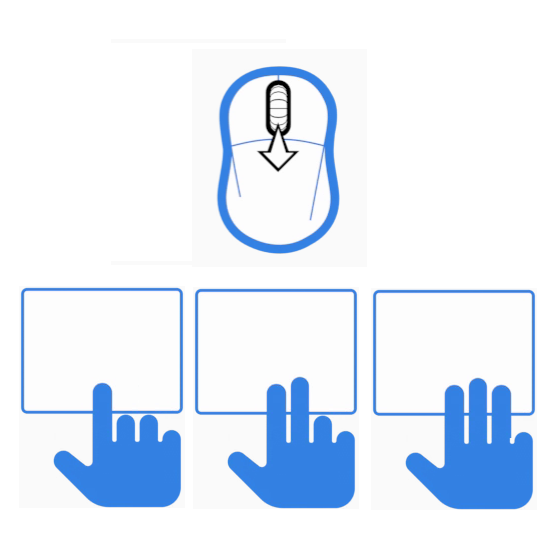
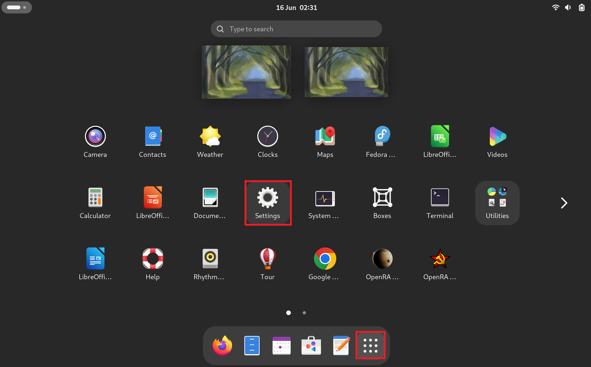
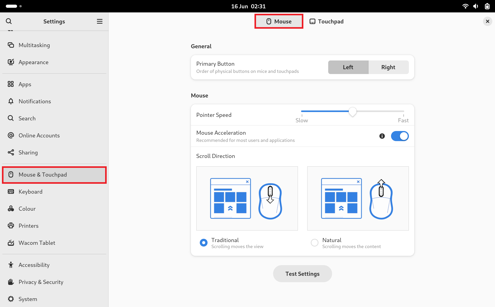
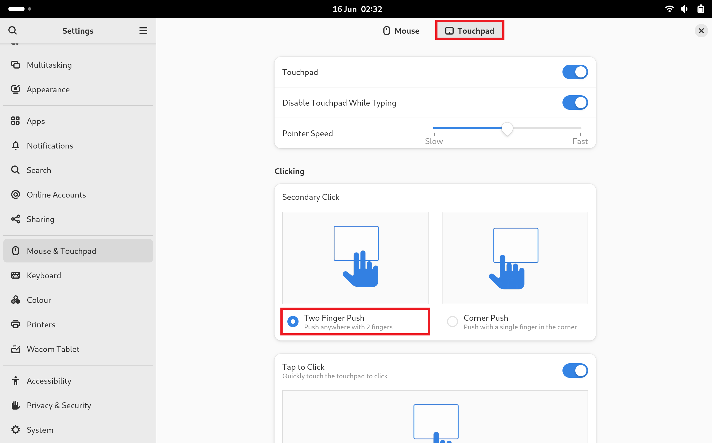
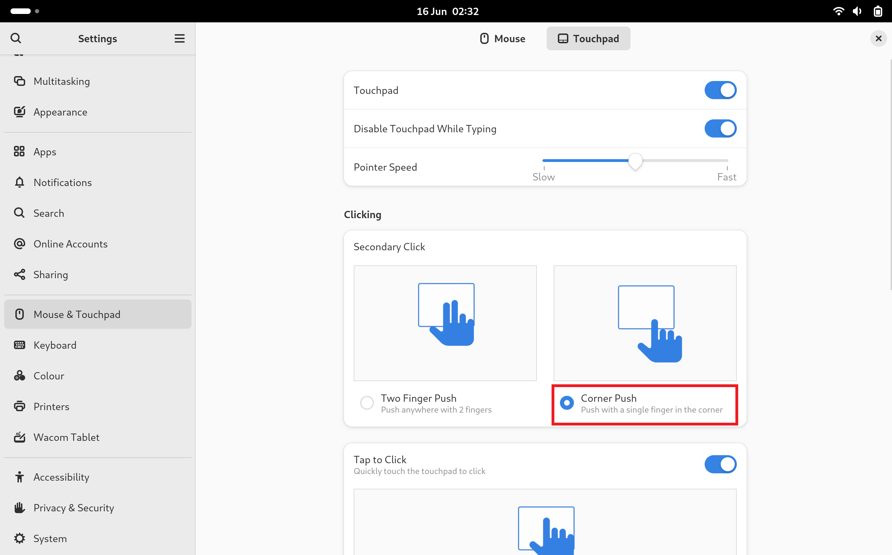

## Touchpad

## Finger Push

On Fedora, the mouse which has physical buttons has a left and right click where:

* left click - primary click
* right click - secondary click

The mouse wheel when pressed down gives:

* middle click - tertiary click

Where the tertiary click performs copy and paste.

The touchpad in Fedora uses a pressure sensor by default and it doesn't matter where you push down on the touchpad but rather how many fingers you push down with:

* 1 finger - primary click
* 2 fingers - secondary click
* 3 fingers - tertiary click (copy/paste)

Press `⊞` to view the GNOME Dock, then select `𓃑` and then select Settings:

Select Mouse and Touchpad. By default the mouse tab will be selected and use button behaviour by default:

To the top select Touchpad. By default the touchpad is configured to use *Finger Push* where pushing down on the touchpad using the pressure of 1-3 fingers performs the primary, secondary and tertiary clicks:

## Corner Push

To change the behaviour to match the behaviour of the mouse and the typical touchpad behaviour on Windows, select corner push, Now the touchpas has:

* left click - primary click
* right click - secondary click

## 3 Finger Gestures

3 Finger Gestures will continue to work regardless of the touchpad clicking setting. Do not push down when using 3-finger gestures. 

A 3 finger swipe up will move to the overview:

Notice the overview scrolls into focus:

This takes to the same overview when `⊞` is pressed:

A 3 finger swipe down will bring the desktop back into focus.

A 3 finger swipe right will move onto the next workspace:

Notice using a three finger gesture to swipe right moves to the next workspace:

Using a three finger gesture to swipe left will move back to the previous workspace.

[Return to Fedora Installation Guide](./readme.md).