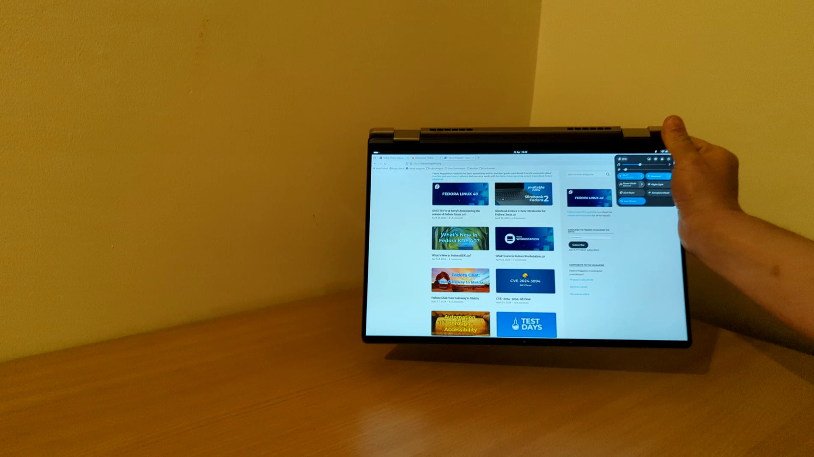

## Touchscreen

### Accessibility Menu

GNOME is the Linux Desktop Environments with the best support for 2-in-1 Touchscreen Devices.

The screen keyboard is not enabled by default and can be accessed via the accessibility menu. Press `⊞` to view the GNOME Dock, then select `𓃑` and then select Settings:

Select Accessibility:

Then select Always Show Accessibility Menu:

The Accessibility icon will now display in the GNOME Titlebar:

This can be selected to view the screen keyboard. When an input field is pressed into, the screen keyboard should automatically populate:

### Laptop Mode

Scrolling using FireFox:

The Accessibility Menu:

Enabling the onscreen keyboard:

Pressing into a touch input field:

Shows the Onscreen Keyboard:

On Laptop Mode, the rotation lock is disabled:

The screen does not auto-rotate when the laptop is turned to its side or upside down

### Tablet and Tent Mode

When the hinge is closed or partially closed (for tent mode), the rotation lock is enabled and Autorotate displays in the top right menu:

The device rotates as expected:

### Issues

While the GNOME Desktop environment offers a superior touchscreen performance to all other Linux Desktop Environments, invokation of the screen keyboard by pressing into a touch field is not as seamless as it should be and sometime multiple presses into the text input field needs to be used. Also the screen keyboard is not automatically enabled when in tablet or tent mode.

There is an incompatibility with the Screen Keyboard with Chromium and the screen keyboard does not display when entering a touch input field. Chromium is the basis of Google Chrome but also lots of other software that are otherwise touchscreen friendly.

[Return to Fedora Installation Guide](./readme.md).