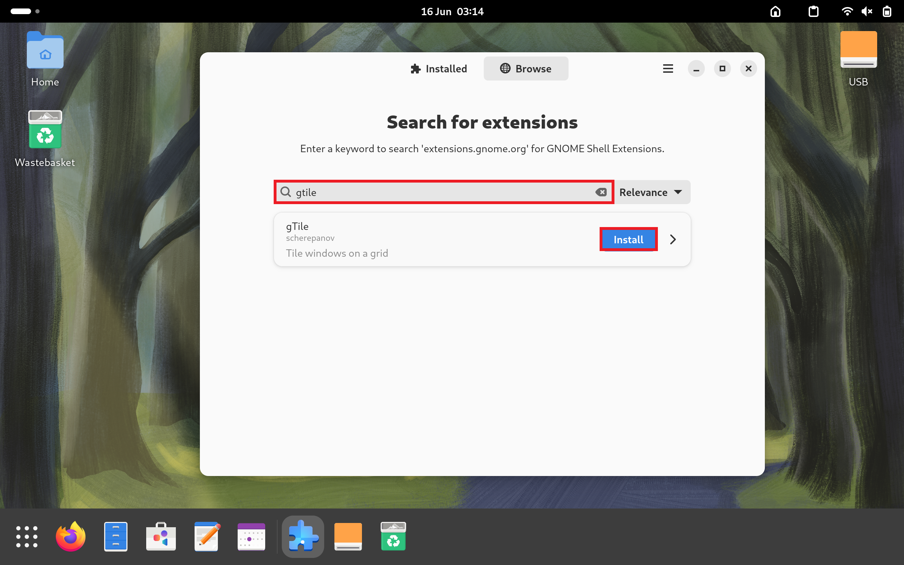

## Tweaks and Extensions

The vanilla GNOME Shell can be modified using tweaks and extensions. Third-party extensions vary in development quality and some may lead to instabilities. The ones mentioned in this guide all have active developers and a large userbase and therefore generally work as expected.

### GNOME Tweaks

Vanilla GNOME does not have a minimise and maximise button. These can be added using GNOME Tweaks:

GNOME Tweaks contains additional settings to GNOME settings, that aren't yet incorporated into GNOME Settings. Essentially there is similar situation between these two applications as the Legacy Control Panel and Windows Settings found in Windows.

GNOME Tweaks is not preinstalled and should be installed from software:

Select Install:

Select Open:

Select the Windows tab and change the Maximise and Minimise Titlebar buttons to On:

Notice these now show in the open Windows.

### GNOME Extensions

GNOME Extensions were originally part of GNOME Tweaks but is now a separate application. It is not preinstalled and needs to be installed using software. There are two versions Extensions (Only shows Extensions maintained GNOME Development Team) and Extension Manager (Allows searching and installation of Extensions by Third-Party Developers). The official Extensions application will be installed first:

Select Install:

Select Open:

Ensure Extensions are enabled:

The App Menu can be used to access applications from the titlebar:

Places can be used to access folders from the titlebar: 

Window list can be enabled to show all the open Windows at the bottom of the screen:

### Extension Manager

The Extension Manager can be installed in software. Select install: 

Select Open:

The Extension Manager looks similar to Extensions however lists User Installed Extensions:

And has a Browse button which can be used to search for other extensions.

#### Dash to Dock Extension

The Dash to Dock Extension is installed by Canonical in Ubuntu to give modified GNOME Desktop Environment. It can be installed in Fedora to make similar modifications or to alternatively make GNOME behave more like the Windows Desktop Environment. Select Install:

Then Install:

Select open extension preferences:

To make modifications similar to Ubuntu in the Position and Size tab select left, disable Intelligent Autohide and disable Panel mode:

To make modifications similar to Windows in the Position and Size tab select bottom, disable Intelligent Autohide and enable Panel mode. Under the launchers tab under Application button `𓃑`, select Move at the beginning of the dock:

For multiple-monitors, in the Position and size tab, select Show on all monitors. In the Launchers tab select Isolate workspaces and Isolate monitors:

#### Desktop Icons NG

The Desktop Icons NG is also preinstalled by Canonical in Ubuntu. Select Install:

Then Install:

Select Open Extension Preferences and amend the preferences as desired:

#### Clipboard History

The Clipboard History extension is also commonly installed. Select Install:

Then Install:

The Clipboard History button shows on the titlebar:

#### Show Desktop Button

The Show Desktop Button extension is also commonly installed. Select Install:

And Install:

The Show Desktop button shows in the titlebar:

And can be used to minimise all Applications, showing the Desktop:

#### Tiling Assistant

The Tiling Assistant extension is also commonly installed. Select Install:

And Install:

Application window snapping can be carried out using: 

* `⊞` + `←` - left half
* `⊞` + `→` - right half 

The Tiling Assistant will display all other windows on the other half of the screen so they can be quickly snapped to the other half:

#### GTile

The GTile extension is also commonly installed. Select Install:

And Install:

The GTile button displays on the title bar. When this button is pressed a dialog will display. A grid size can be selected from the dialog:

And tiles within the grid can be highlighted:

This will snap the last selected Application Window to the provided specification:

[Return to Fedora Installation Guide](./readme.md).