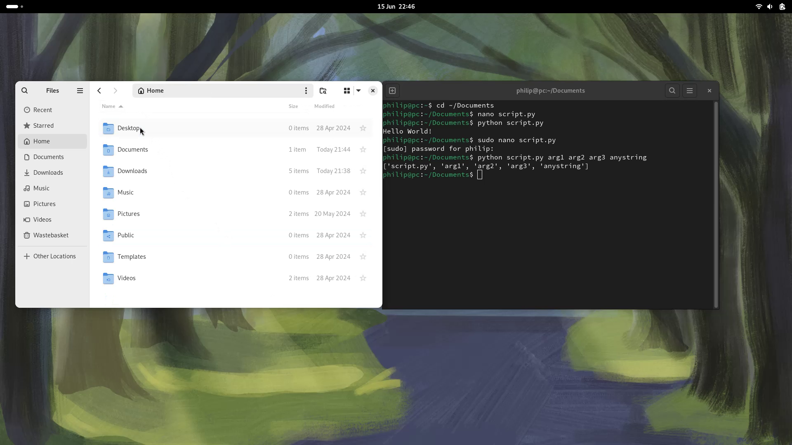

## GNOME Desktop Environment

Fedora has a Vanilla GNOME Desktop Environment which behaves slightly different to Microsoft Windows and is optimised for screen space. The GNOME Dock is hidden by default.

Press `⊞` to view the GNOME Dock. This will take the application out of focus. All applications will be re-tiled so the open application of interest can be selected. The dock has the all applications button which is similar to the Windows start screen.


An application such as Nautilus file explorer can be opened from the dock:


Nautilus opens in Home by default:


The Documents folder can be selected:


There is now a single application open. When `⊞` is pressed, this single application displays:


The `𓃑` button on the dock can be used to select all applications:


In this case, the Terminal will be launched:


Notice the prompt has the form:

```
username@pcname:location$
```

In this case the location is `~` meaning Home:


If the Documents folder is selected and right clicked (2 finger press on a touchpad), Open in Terminal can be selected:


Notice the location is now `~/Documents` where `/` is the default directory separator on Linux:


The binary `cd` can be used to change the directory. The directory to be changed to is then supplied as a command line argument. This has the general form:

```bash
binary command_arg
```

In this case:

```bash
cd ~
```

Notice the location is now `~` as expected:


Changing back to Documents, recall the binary is `cd` and the command line argument is `~/Documents`

```bash
cd ~/Documents
```

The binary `nano` is a terminal based text editor and will open in the location specified in the Terminal, in this case `~/Documents`. If supplied with a file name, expressed as a command line argument it will open the file if it exists, or create a new file with that file name when saved:  

```bash
nano script.py
```


Python code can be added to this `script.py` file. For example:

```python
print('Hello World!')
```

`Ctrl` + `x` can be pressed to exit nano:


To save select `y`:


Press `↲` to save using the file name previously specified `script.py`:


Notice this file is now created and displays in files:


It can be viewed in text editor:


The binary `python` can be launched, supplying `script.py` as a command line argument:

```bash
python script.py
```


The binary `python` will open, execute all the code in the file and then exit:


Now multiple applications are open. Press `⊞` to view the GNOME Dock. This will take all applications out of focus. An application can be selected to be put on top:


If `⊞` is selected a search for the Gparted application can be made:


It is not installed, so a suggestion is made from software:


It can be installed:


It can be launched:


Gparted is a partition editor which requires root access and needs to be run as a super user. To run the application as a super user, an authentication prompt shows. To authenticate, the user password needs to be input:


Gparted now launches:


This is equivalent to run as administrator on Windows and is equivalent to a User Account Control Prompt which was seen for example when Rufus was launched:


Vanilla GNOME has no minimise and maximise button. Application window snapping can be carried out using: 

* `⊞` + `←` - left half
* `⊞` + `→` - right half 
* `⊞` + `↑` - full screen maximised

The title bar can also be right clicked (2 finger press for a touchpad) for other options:


If this Application is Hidden:


It can be viewed by pressing `⊞` where all open apps will be tiled:


If a binary is prefixed with `sudo` it is an instruction to run the binary as a super user instead of a user. This gives it access to root and other privileges:

```bash
sudo binary command_arg
```

For example, `nano` can be run as a super user using:

```bash
sudo nano script.py
```


This script file now exists, so is opened:


The Python code can now be updated to print out the command line arguments:

```python
import sys
arguments = sys.argv
print(arguments)
```

It can be saved as before:


The file can be reloaded in the text editor:


Now the binary `python` can be used and supplied a script file as a command line argument, alongside some other optional command line arguments:

```bash
python script.py arg1 arg2 arg3 anystring
```

Notice the first command line argument is `script.py`, the second is `arg1`, the third is `arg2`, the fourth is `arg3` and so on. Notice each of these are returned in quotations denoting that the command line arguments are always recognised as a string.

The default programming language for the Linux Terminal is `bash` and this prefers double quotations for strings, Python on the other hand is a different programming language which prefers single quotations for strings. The above command could therefore also be written as:

```bash
python "script.py" "arg1" "arg2" "arg3" "anystring"
```

Generally the double quotations are only used around a command line argument string when it contains a space, because otherwise the space is an instruct to move onto the next command line argument:


If other locations are selected in Nautilus File Explorer, the root drive can be accessed:


Any folder on the root drive, except the users home folder cannot be modified as a standard user and requires super user access. If the `bin` folder is examined:


Notice that it contains the binaries previously input into the Terminal, for example `nano`:


And `python`. Note that this is the operating system Python and contains only Python and the standard libraries. The system Python should be regarded as part of the Operating System and is updated as part of the Operating System.

For Python development, a user Python should be installed in the users home folder for example by using Miniconda or Anaconda. This allows the user to create a user conda Python environment were they can specify their Python version and third-party libraries without breaking the Operating System:


The binary `bash` is the default programming language used by the Linux Terminal:


The binary `dnf` is Fedora's package manager:


The home folder can be accessed from the root drive:


A standard user can only access the subfolder corresponding to their own username by default i.e. this subfolder is home for the standard user:


And is the location when Home is selected on Nautilus or Nautilus is opened by that user:



The binary `man` can be used to view the manual for a binary name supplied as a command line argument. For example the manual for the package manager can be viewed by inputting:

```bash
man dnf
```


This can be scrolled through using the Terminal. To quit scrolling press `q`:


This returns back to the Terminal:


[Return to Fedora Installation Guide](./readme.md).
