## Wayland

### Display Driver Models 

Linux has two display driver models the modern Wayland and legacy X11. 

On Fedora with GNOME, Wayland is the default display driver model. On the Fedora LXDE Spin, X11 is the default display driver model.

X11 was designed for a system with a single monitor or two matching monitors and therefore supported only standard scaling across all monitors.

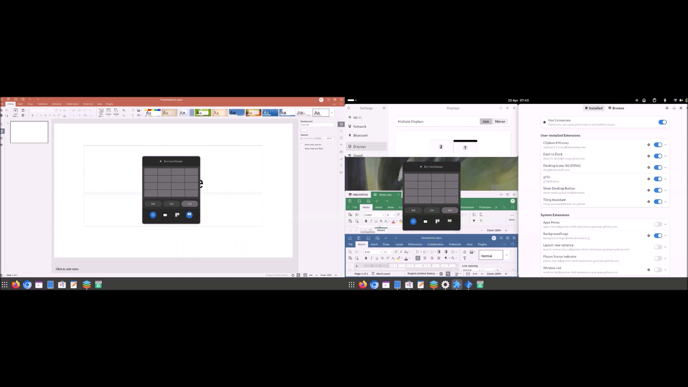

### WD19TB Docking Station

Nowadays it is common to dock a non-touchscreen monitor with a laptop touchscreen that has a much higher screen resolution:

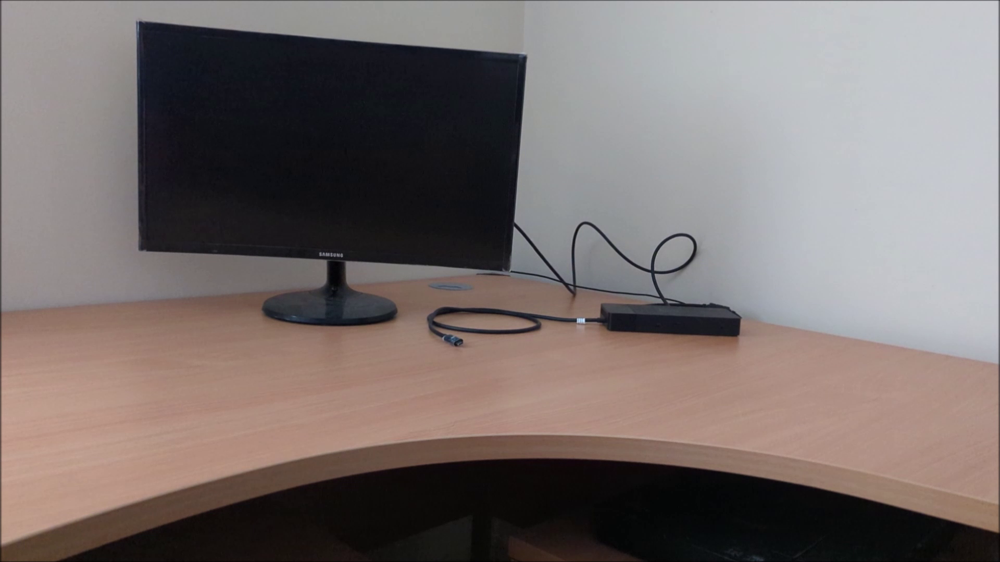

In order for these two monitors to work well together, they need to use Wayland with a different screen resolution on each monitor:

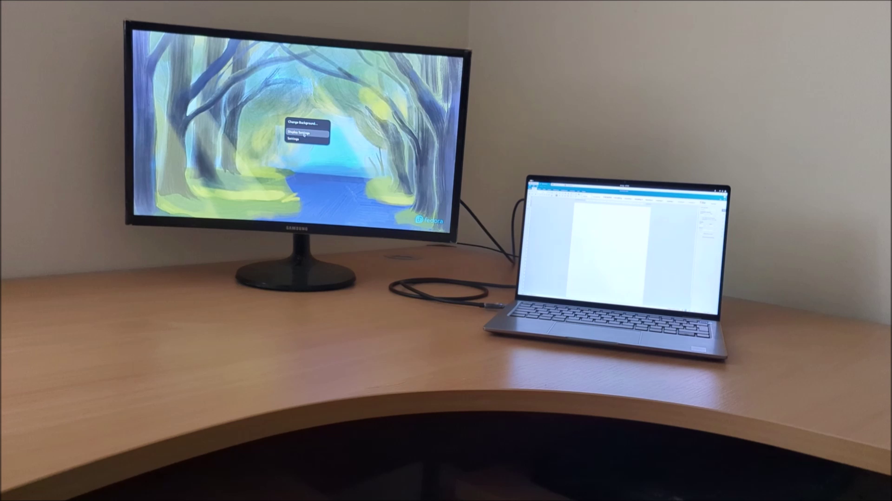

### Fractional Scaling

Fractional Scaling is not enabled by default and only integer values of 100 % scaling are supported for each monitor. If the touchscreen monitor is right clicked and Display Settings are opened:


It defaults to 100 % which is slightly too small and 200 % which is slightly too big:

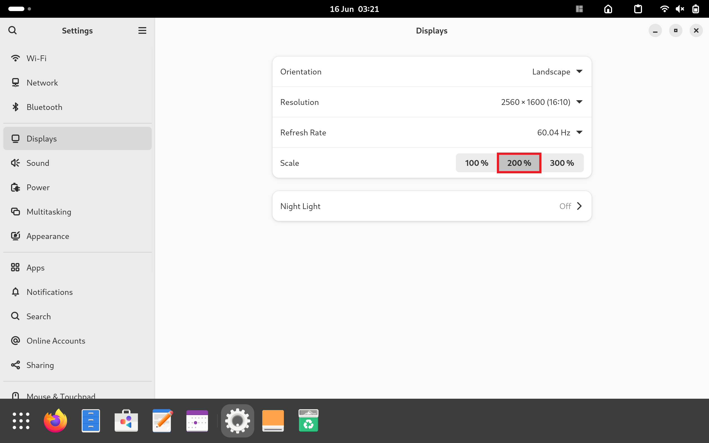

The experimental fractional scaling setting is enabled by default on Ubuntu but not on Fedora. Press `⊞` to view the GNOME Dock, then select `𓃑` and then select Terminal:

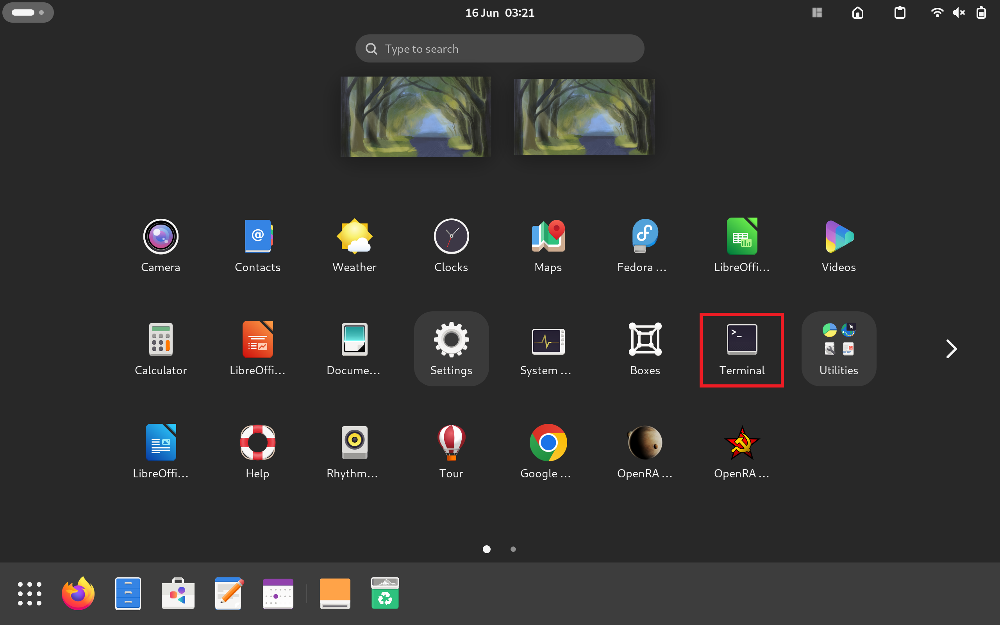

Input the following command:

```bash
gsettings set org.gnome.mutter experimental-features "['scale-monitor-framebuffer']"
```

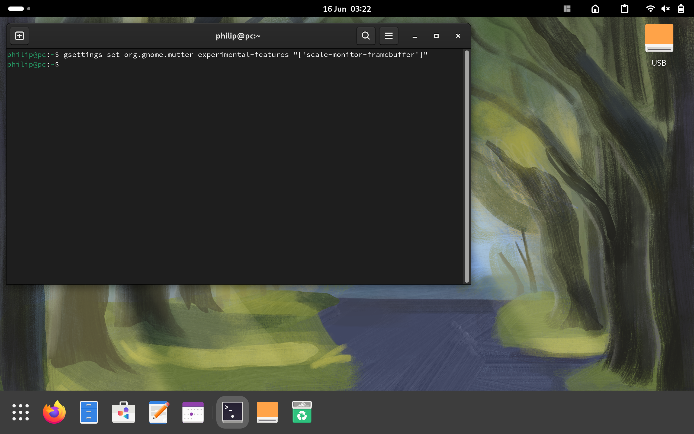

Then restart. Once restarted, the Fractional Scaling settings display:

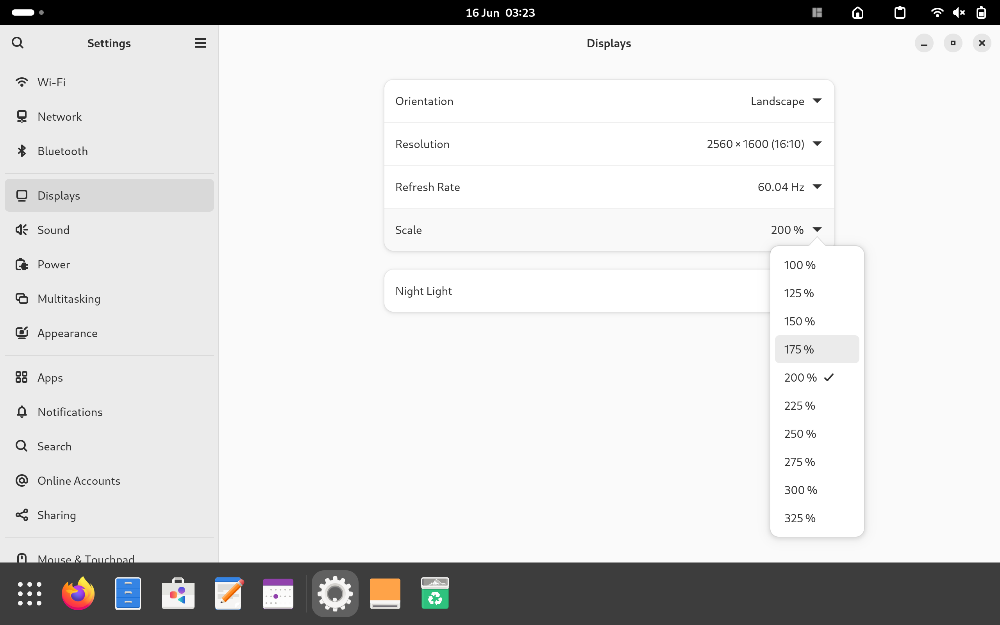

The monitor and the laptop screen can be seen below:


The laptop screen is high resolution has 2560x1600 pixels and a default scaling of 200 %:

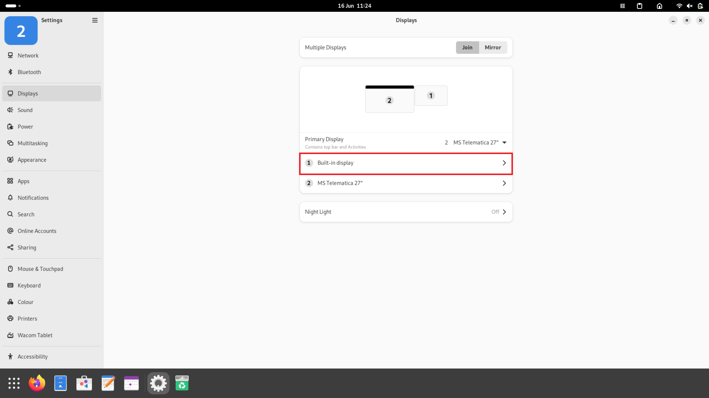

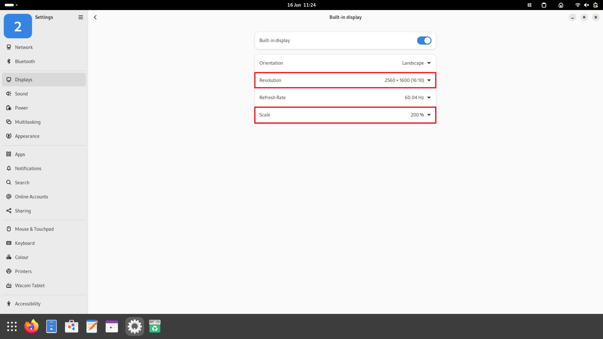

The monitor screen has 1920x1080 pixels and a default scaling of 100 %:

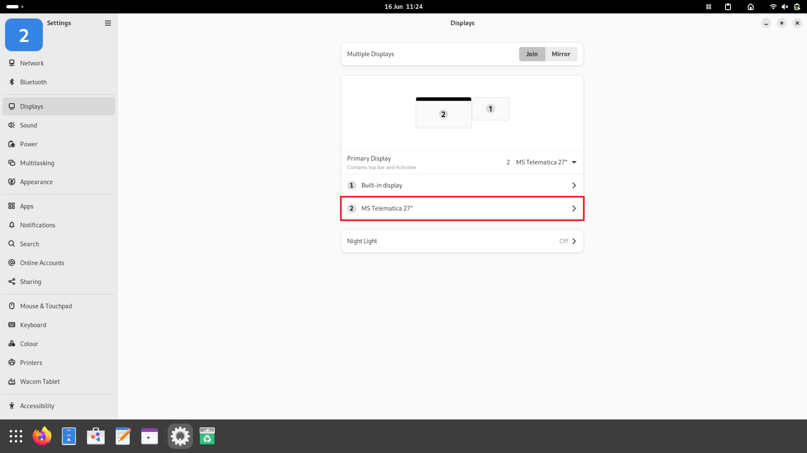

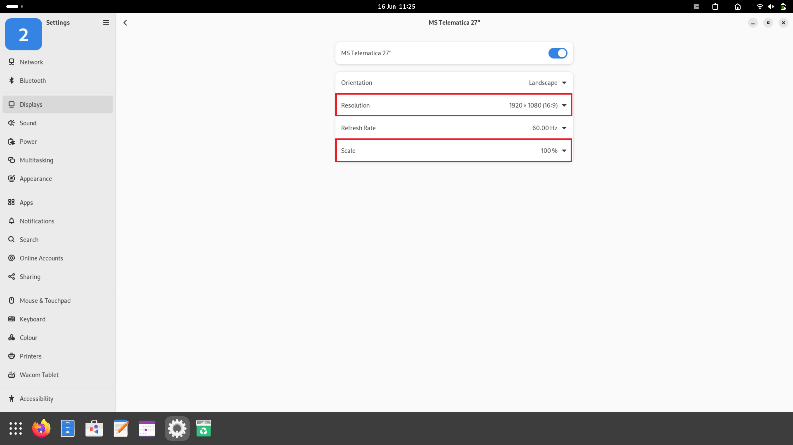

With fractional scaling, the laptop screen can be changed to 150 %:

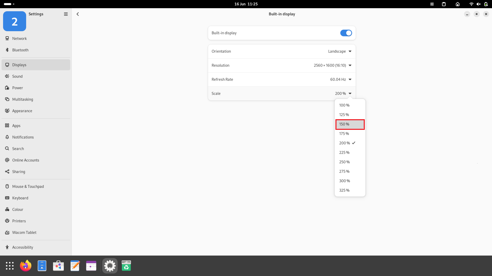

Once Apply is selected:

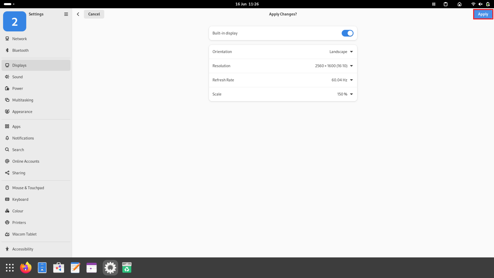

Select Keep Settings can be selected:


The contents on both monitors can now be read well:


### Removing Fractional Scaling

If there is any instability with this experimental feature it can be disabled. To turn this feature off, open up a Terminal and input:


```bash
gsettings set org.gnome.mutter experimental-features "[]"
```

[Return to Fedora Installation Guide](./readme.md).

